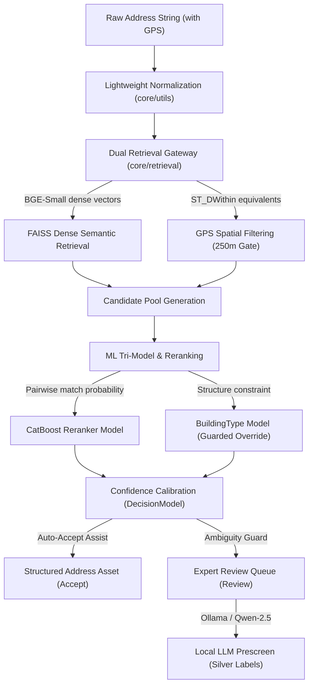

# AddressForge: Next-Generation Address Intelligence Engine

AddressForge is a next-generation address intelligence and entity resolution engine. Moving beyond traditional regex string parsing (Parser-first), AddressForge shifts to a **Retrieval-First / Entity Resolution** paradigm, resolving raw address descriptions to unique physical geospatial entities.

---

## 🏗️ Core Architecture (v2.1 - v2.5 Evolution)



---

## 🚀 Key Features

### 1. Dual Retrieval & Numerical Precision (v2.3)
- **Vector Semantic Search**: Encodes input queries into 384-dimensional dense vectors using `bge-small-en-v1.5` embeddings, matched against the standard database via FAISS.
- **GPS Spatial Constraint**: Filters and ranks candidates based on physical distance using the Haversine formula (within a $250\text{m}$ gate: `ADDRESSFORGE_GPS_CONFLICT_METERS`).
- **GPS Conflict Guard**: Flags mismatched query-reference coordinates with `gps_conflict = True` to prevent vector similarity hallucinations and skip invalid ML reranker alignment.

### 2. Tri-Model Orchestration & Guarded Overrides
- **Reranker Model**: Pairwise learning comparing query-candidate features (edit distance, text alignment, postal matched, and semantic alignment).
- **BuildingType Model**: Classifies single-unit vs multi-unit structures. When $\ge 0.85$ confidence for single-unit is met, a guarded override removes phantom unit numbers, preventing false alarms.
- **Decision Model (Assist Mode)**: Evaluates confidence boundaries. In `assist_trial` mode, high-confidence model validations automatically skip manual queue backlogs.
- **LLM Refiner**: Integrates local Ollama/Qwen for edge-case diagnostics, generating draft corrections and `silver_label` suggestions.

### 3. Continuous Ingestion & Cleaning Pipeline (v2.1 - v2.2)
- **Composite Cursor Pagination**: Database-driven ingestion uses `updated_at + external_id` cursors for safe incremental synchronization.
- **Chained Trigger Processing**: Successful ingestion automatically chains to a `run_cleaning_once` job.
- **Feature Flags Tagging**: Auto-tags flags like `has_double_number`, `is_numbered_road`, and `has_explicit_unit` on ingestion, serving as indices for Active Learning queue filters.

### 4. Reference Fusion & Unit Mining (v2.4)
- **Multi-Source Reference Fusion**: Groups and merges duplicate reference data (from OSM, GeoNova, manual sources) sharing the same base address, preserving provenance in JSON attributions.
- **Delivery Unit Mining**: Mines valid unit numbers from highly successful historical transactions ($\ge 0.90$ confidence accepts) and dynamically backfills them into the canonical unit library to reduce future `enrich` gaps.

### 5. Hardened Promotion & Rollback Consistency (v2.5)
- **Consistency Gate**: Promote operations automatically verify physical artifact completeness (`.pkl`, `.json`, `.cbm`) of all three models on disk.
- **Emergency Rollback**: Supports instant rollback to the last known stable manifest, invalidating runtime TTL caches.

---

## 🛠️ Project Structure

```text
src/addressforge/
├── api/            # Public Normalization, Parsing, Validation, and Admin APIs
├── console/        # Control Center & Review Lab Web Application Server
├── control/        # Background Worker and Distributed Job Queue Processors
├── core/           # Core Engines: retrieval (FAISS), reference matcher, and normalization profiles
│   └── profiles/   # Localization profiles (base_canada, etc.)
├── learning/       # Model Trainer, Evaluator, and Active Learning features
├── pipelines/      # Orchestrated pipeline scripts (exports, schemas, shadow runs)
└── services/       # Business logic (asset management, model manifest reloading, replay, fusion)
```

---

## 🚀 Operations SOP

### 1. Vector Index Construction
Build the FAISS dense retrieval indexes from active external reference databases:
```bash
PYTHONPATH=src .venv/bin/python scripts/build_vector_index.py
```

### 2. Run Reference Fusion & Unit Mining
Perform multi-source building merging and backfill unit numbers from historical successes:
```bash
PYTHONPATH=src .venv/bin/python -c "from addressforge.services.fusion_service import run_reference_enrichment_pipeline; run_reference_enrichment_pipeline()"
```

### 3. Training & Evaluation Cycle
Train the CatBoost tri-model set (Decision, Reranker, BuildingType) and evaluate against the benchmark:
```bash
# Run full training pipeline
bash scripts/run_evolution_cycle.sh

# Run model evaluation report
PYTHONPATH=src .venv/bin/python scripts/run_latest_eval.py
```

### 4. Running the Test Suite
Ensure zero regression on address validation logic:
```bash
PYTHONPATH=src .venv/bin/pytest tests/
```

---

## 📖 Key Documentation

Detailed design specifications can be found under the `docs` folder:
- **Retrieval-First Evolution**: [retrieval_first_evolution_spec.md](docs/en/architecture/retrieval_first_evolution_spec.md) ([ZH](docs/zh/architecture/retrieval_first_evolution_spec.md))
- **Ingestion & Cleaning Spec**: [ingestion_cleaning_evolution_spec.md](docs/en/architecture/ingestion_cleaning_evolution_spec.md) ([ZH](docs/zh/architecture/ingestion_cleaning_evolution_spec.md))
- **Next-Gen Evolution Roadmap**: [next_generation_roadmap.md](docs/en/architecture/next_generation_roadmap.md) ([ZH](docs/zh/architecture/next_generation_roadmap.md))
- **Metrics Acceptance Gate**: [metrics_acceptance_framework.md](docs/en/governance/metrics_acceptance_framework.md) ([ZH](docs/zh/governance/metrics_acceptance_framework.md))
- **Operation Product Manual**: [operation-subsystem-guide.md](docs/en/operations/operation-subsystem-guide.md) ([ZH](docs/zh/operations/operation-subsystem-guide.md))

---
*AddressForge: Resolving address strings to intelligent spatial assets.*
