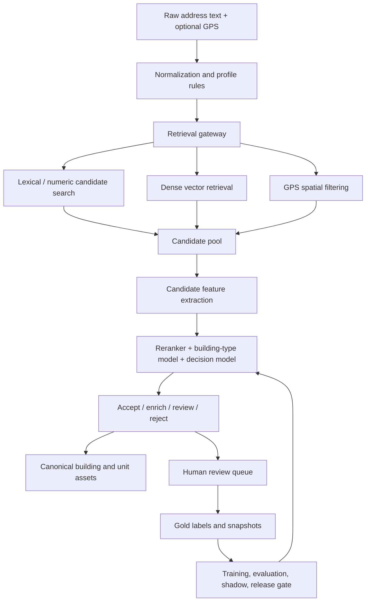

# AddressForge

AddressForge is an open-source, self-hosted address intelligence platform for turning messy address text into traceable, canonical address assets.

It is built for teams that have real address data problems: delivery addresses typed by customers, historical order records, inconsistent unit numbers, duplicate building records, incomplete references, and a growing manual-review backlog. AddressForge gives those teams a private system they can run themselves to parse, clean, validate, review, train, and serve address intelligence through APIs.

The default profile focuses on Canada / North America, with Halifax / Nova Scotia as the reference scenario. The architecture is intentionally profile-based so other regions can replace the country-specific rules, reference data, gold labels, and model artifacts.

---

## What AddressForge solves

Most address projects start with string parsing: split the text, normalize abbreviations, and hope the pieces are correct. That breaks down quickly when real inputs contain apartment units, business names, missing punctuation, GPS conflicts, stale reference data, or local formatting habits.

AddressForge treats an address as a physical entity-resolution problem:

> Given a noisy address description, find the most likely building and unit, explain the evidence, and decide whether the result is safe to accept or needs review.

This lets a self-hosted operator:

- convert raw address strings into structured fields such as unit, street number, street name, city, province, postal code, building type, and confidence
- clean historical address libraries in batch without sending private data to a third-party SaaS
- resolve inputs against canonical building and unit assets instead of relying only on regex output
- detect ambiguous cases, missing units, likely false units, GPS conflicts, and reference mismatches
- route only uncertain records to human review
- turn approved human corrections into gold labels for retraining
- version, evaluate, promote, and roll back address models with release gates
- expose the cleaned capability through local APIs for other applications

---

## Who can use it

AddressForge is useful for:

- logistics and delivery platforms that need better drop-off accuracy
- e-commerce, CRM, marketplace, and dispatch systems with noisy customer-entered addresses
- data engineers cleaning historical address tables
- backend engineers who need a private address parsing / validation API
- GIS or data-quality teams building canonical building and unit assets
- developers adapting an address intelligence stack to their own country or region

It is not designed as a hosted multi-tenant SaaS. The intended model is: clone it, deploy it in your own environment, connect your own data, train your own model, and keep ownership of your data and artifacts.

---

## Core capabilities

### 1. Address parsing and normalization

AddressForge normalizes raw text and extracts structured address components. The Canada profile handles common North American patterns such as unit prefixes, civic numbers, street suffixes, cities, provinces, and postal codes.

Typical API capabilities:

- `normalize`: clean casing, spacing, abbreviations, and tokens
- `parse`: extract structured candidates from raw text
- `validate`: decide `accept`, `enrich`, `review`, or `reject`
- `explain`: return human-readable evidence for a decision
- `model`: report active model, reference, and profile versions

### 2. Batch cleaning for private address libraries

The platform can ingest raw addresses from CSV, direct database import, or API pull. Incremental ingestion uses cursor-based sync so an operator can repeatedly process new records without duplicating old ones.

The cleaning pipeline stores raw inputs, parser outputs, validation results, canonical entity links, review tasks, and model evidence rather than overwriting the original facts.

### 3. Canonical building and unit assets

AddressForge is not just a parser. It can build and maintain a canonical address asset layer:

- canonical buildings
- canonical units
- user-observed address facts
- external reference evidence
- versioned snapshots

This matters when the same real-world place appears in many forms, for example `4-47 Albro Lake Rd`, `Unit 4 47 Albro`, and `47 Albro Lake Road Apt 4`.

### 4. Retrieval-first entity resolution

The newer architecture resolves addresses by retrieving likely canonical entities first, then reranking them with model features. This avoids a common parser-first failure: if the parser splits the raw string incorrectly, the correct building may never reach the downstream model.

AddressForge combines:

- lightweight normalization
- lexical and numeric matching
- dense vector retrieval using FAISS-compatible indexes
- GPS distance and conflict checks
- candidate-level feature extraction
- ML reranking and calibrated decision gating

### 5. Human-in-the-loop review

Ambiguous records are sent to a review queue instead of being silently accepted. Operators can inspect the raw address, parser result, model confidence, reference hits, risk flags, and optional local LLM draft suggestions.

Human-approved corrections become gold labels. The system treats human review as authoritative and keeps non-human suggestions as draft or silver-label evidence unless a person confirms them.

### 6. Continuous learning and model governance

AddressForge includes a learning loop for improving local behavior over time:

1. ingest real data
2. clean and score records
3. identify review/error buckets
4. collect human gold labels
5. train candidate models
6. evaluate and shadow them against previous behavior
7. promote or roll back with artifact checks

The model stack includes decision calibration, candidate reranking, and building-type classification. Release gates track metrics such as decision F1, unit recall, building-type F1, review rate, reject rate, and replay disagreement rate.

### 7. Control console

The web console is the human control plane for non-code operation:

- start ingestion and cleaning jobs
- monitor job status and runtime reports
- inspect cleaning performance and error buckets
- review ambiguous addresses
- freeze gold snapshots
- trigger training / evaluation
- promote or roll back model versions
- inspect canonical address assets

Long-running work stays in backend workers; the console triggers and observes it.

---

## Architecture at a glance



Project layout:

```text
src/addressforge/
├── api/            # Public normalization, parsing, validation, explain, and model APIs
├── console/        # Control console and review UI server
├── control/        # Background jobs, worker, runtime settings
├── core/           # Configuration, normalization, reference, retrieval, LLM support
├── ingestion/      # CSV, API, and database ingestion providers
├── learning/       # Training, evaluation, gold labels, active learning, shadow runs
├── models/         # Model registry and active/candidate model metadata
├── pipelines/      # Import, ingestion, cleaning, training, export scripts
└── services/       # Business, cleaning, fusion, model, replay, review, workspace services
```

---

## Quick start

### 1. Install

```bash
cd addressforge
python3 -m venv .venv
source .venv/bin/activate
pip install -U pip
pip install -e .
cp .env.example .env.local
```

Edit `.env.local` and set at least:

- `MYSQL_HOST`
- `MYSQL_USER`
- `MYSQL_PASSWORD`
- `MYSQL_DATABASE`

AddressForge loads configuration from the project root in this order:

1. `.env.local`
2. `.env`
3. defaults in `src/addressforge/core/config.py`

### 2. Initialize the schema

```bash
./scripts/init_schema.sh
```

### 3. Import sample data

```bash
export ADDRESSFORGE_IMPORT_CSV_PATH=examples/sample_raw_addresses.csv
./scripts/import_csv.sh
```

### 4. Start the API

```bash
./scripts/run_api.sh
```

Useful endpoints:

- `GET /health`
- `GET /api/v1/model`
- `POST /api/v1/normalize`
- `POST /api/v1/parse`
- `POST /api/v1/validate`
- `POST /api/v1/explain`

Example:

```bash
curl -X POST http://127.0.0.1:8010/api/v1/validate \
  -H "Content-Type: application/json" \
  -d '{"raw_address_text": "unit 4 - 47 Albro lake rd Halifax"}'
```

### 5. Start worker and console

```bash
./scripts/run_control_worker.sh
./scripts/run_console.sh
```

Then open:

- API: `http://127.0.0.1:8010`
- Console: `http://127.0.0.1:8011`

### 6. Run training / evaluation loop

```bash
./scripts/run_training.sh
./scripts/run_evolution_cycle.sh
PYTHONPATH=src .venv/bin/python scripts/run_latest_eval.py
```

---

## Connect your own data

AddressForge supports three practical ingestion paths.

### CSV import

Use this when bootstrapping or testing:

```bash
export ADDRESSFORGE_IMPORT_CSV_PATH=path/to/your/company_addresses.csv
./scripts/import_csv.sh
```

### API pull

Use this when another system exposes raw address records through an HTTP endpoint. Configure:

- `ADDRESSFORGE_INGESTION_MODE=api`
- `ADDRESSFORGE_INGESTION_API_URL`
- `ADDRESSFORGE_INGESTION_API_ADAPTER`
- API field mapping variables as needed

Then run:

```bash
./scripts/run_ingestion.sh
```

### Direct database ingestion

Use this when raw address records already live in a private database table. Configure:

- `ADDRESSFORGE_INGESTION_MODE=db`
- `ADDRESSFORGE_INGESTION_DB_HOST`
- `ADDRESSFORGE_INGESTION_DB_USER`
- `ADDRESSFORGE_INGESTION_DB_PASSWORD`
- `ADDRESSFORGE_INGESTION_DB_NAME`
- `ADDRESSFORGE_INGESTION_DB_TABLE`
- cursor and column mapping variables

Then run:

```bash
./scripts/run_ingestion.sh
```

---

## Adapt it to another region

The default implementation is Canada / North America first, not global one-shot coverage. To adapt AddressForge to another country or local domain, replace the region-specific layers while keeping the platform skeleton:

- create or update a normalization profile under `src/addressforge/core/profiles/`
- load local public or private building reference data
- build lexical / vector retrieval indexes for that reference set
- collect human-reviewed gold labels from your own data
- retrain reranking, decision, and building-type models
- evaluate against local benchmark and replay data before promotion

See [ML Learning & Customization Guide](docs/en/getting-started/ml_learning_and_customization_guide.md).

---

## What AddressForge is not

- It is not a hosted address-cleaning SaaS.
- It is not a billing, tenant, or account-management platform.
- It does not claim universal global address coverage out of the box.
- It does not replace human review for ambiguous gold-label decisions.
- It should not be tuned from synthetic examples only; real data, real metrics, and before/after comparisons are part of the system workflow.

---

## Documentation

- [Documentation Hub](docs/en/README.md)
- [Quick Start](docs/en/getting-started/addressforge-quickstart.md)
- [Developer Workflow](docs/en/getting-started/addressforge-developer-workflow.md)
- [Product Requirements](docs/en/product/addressforge-requirements.md)
- [System Design](docs/en/architecture/addressforge-design.md)
- [API Documentation](docs/en/architecture/addressforge-api.md)
- [Retrieval-First Evolution Spec](docs/en/architecture/retrieval_first_evolution_spec.md)
- [Model Training Guide](docs/en/ml/addressforge-model-training-guide.md)
- [Release Benchmark](docs/en/ml/addressforge-release-benchmark.md)
- [Operations Guide](docs/en/operations/operation-subsystem-guide.md)
- [Metrics Acceptance Framework](docs/en/governance/metrics_acceptance_framework.md)
- [Chinese Documentation](docs/zh/README.md)

---

## Operating principle

AddressForge is designed for closed-loop address quality improvement:

1. inspect real data
2. identify concrete failure patterns
3. define the requirement
4. implement a technical method
5. validate on database-backed samples, artifacts, API responses, or replay outputs
6. compare against the previous baseline
7. decide the next iteration from evidence

That workflow is part of the product. It is how the system avoids becoming a pile of one-off parsing rules.

---

*AddressForge: private, trainable address intelligence for canonical buildings, units, and APIs.*
