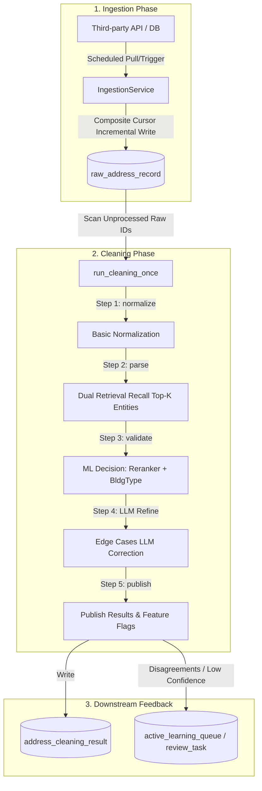

# AddressForge Ingestion & Automated Cleaning Pipeline Evolution Specification
## Multi-source Ingestion and High-Precision ML Cleaning Pipeline Technical Spec and Architecture Document

> **Status**: System Architecture and Design Specification  
> **Goal**: For raw address data periodically or incrementally imported from third-party systems (APIs/Databases), define specifications for data ingestion, pipeline cleaning, ML model calibration, and safety gates within the Retrieval-first next-generation architecture.

---

## 1. Context & Challenges

With the model upgrade of AddressForge's core Normalize/Validate interfaces, the backend periodic cleaning pipeline (Ingestion & Cleaning Pipeline) must align with the latest ML decision policies. Raw data imported from third-party interfaces faces three core challenges:

1. **High-Noise Inputs**: Third-party order data is frequently cluttered with handwriting abbreviations, multiple unit identifiers (e.g. `Apt 2B-3`), merchant names, and false matches due to regional administrative divisions or French spelling variances (e.g. `Grand Pre` vs `North Grand Pré`).
2. **Data Scale & Throughput**: Periodic batch data imports (ranging from thousands to tens of thousands of records) can easily overload the human review queue (`review`) if not filtered efficiently.
3. **Parsing Cascade Degradation**: If the parser fails at tokenization, old architectures cannot recover the correct address representation.

Therefore, the incremental cleaning pipeline must center around **"Retrieval-first + ML Reranking (CatBoost Reranker) + BuildingType Calibration + Local LLM Refinement"**.

---

## 2. Ingestion & Cleaning Pipeline Architecture



### 2.1 Incremental Ingestion Service

`IngestionService` supports two primary third-party data source modes:
1. **API Ingestion Mode**:
   - Uses `LegacyBatchOrdersApiAdapter` to pull batch lists of order records.
   - To bypass transient token authorization issues or 401 errors, it supports static override via `ADDRESSFORGE_INGESTION_BATCH_LIST_OVERRIDE` to directly fetch order batches.
2. **Database Ingestion Mode**:
   - Implements **Composite Cursor Pagination** based on `updated_at` and `external_id` (or `order_id`) to scan database records. This avoids performance issues related to deep paging (`LIMIT OFFSET`) and prevents missing data.
   - Cursor positions are atomically written back to `source_ingestion_cursor` to support incremental recovery.

### 2.2 Manual Triggers & Job Chains

- **Manual Trigger Mode**: To safeguard production workflows, automated polling is **disabled by default (`continuous_mode.enabled = false`)**. Ingestion is triggered manually via the control center UI, APIs, or scripts as an `ingestion_once` job.
- **Follow-up Cleaning Job**: When `ingestion_once` succeeds with `records_ingested > 0`, the system automatically enqueues a `cleaning_once` task with lower priority in the background queue if `pipeline.auto_clean.enabled = true` is set. This ensures newly imported data is cleaned within minutes.

### 2.3 ML Entity Resolution & Decision Flow

Within the `run_cleaning_once` loop, the following decision flow is applied for each raw record:

1. **Dual Retrieval**: Given a normalized query, a hybrid search combines results from the dense vector database (`VectorRetrievalGateway` using local FAISS and `bge-small-en-v1.5`) and lexical matching (`simple_rule` or database FTS) to recall the top-K building entities.
2. **CatBoost Multi-Model Disambiguation**:
   - **Reranker** sorts and ranks the candidates using edit distance, exact numeric matches, and semantic alignment to select the best canonical candidate.
   - **Decision Model** evaluates matching confidence. Under `assist_trial` mode, high-confidence ML predictions can automatically override heuristic decision gates, cutting down manual review overhead.
   - **BuildingType Model** checks building structure types. If the heuristics detect a unit mismatch but the classifier predicts `single_unit` with high confidence ($\ge 0.85$), the system applies a **Guarded BuildingType Override** (`bt_override_applied = true`) to strip the phantom unit number, preventing false alarms.
3. **Feature Flags Extraction**:
   Before publishing cleaning results, the engine computes and logs structural properties:
   - `has_double_number`
   - `is_numbered_road`
   - `has_explicit_unit`
   These flags serve as indexing criteria for the **Active Learning** queue filter.

---

## 3. Database Schema Relationships

```
+------------------------+      1      +--------------------------+
|  raw_address_record    |------------>| address_cleaning_result  |
|                        |             |                          |
|  - raw_id (PK)         |             | - raw_id (FK, Unique)    |
|  - raw_address_text    |             | - decision (accept/rev)  |
|  - source_cursor       |             | - building_type          |
|  - is_active = 1       |             | - feature_flags          |
|  - is_active = 1       |             | - validation_json (ML)   |
+------------------------+             +--------------------------+
            ^
            | 1..* (ETL Import)
+------------------------+
|      control_job       |
|                        |
|  - job_id (PK)         |
|  - job_kind            |
|  - status              |
|  - payload_json        |
+------------------------+
```

---

## 4. Key Design & Operational Principles

When developing and running the ingestion/cleaning pipeline, developers must strictly adhere to:

1. **Absolute Boundary: Never Write LLM Outputs as Human Gold**:
   LLM-suggested edits (`llm_refiner`) must be marked as `llm_draft` or `silver_label`. They **must never** be marked as `human` source gold. Any training datasets or release benchmarks must rely on human-confirmed entries.
2. **Composite Cursor Atomicity**:
   Cursor values must be updated atomically using `ON DUPLICATE KEY UPDATE` to avoid write concurrency conflicts.
3. **Traceability & Logging Standards**:
   All decision overrides (such as `shadow_assist` or `bt_override_applied`) must log their model confidence scores, feature vectors, and target transitions in `validation_json` and `worker.log` for future shadow replay audits.
