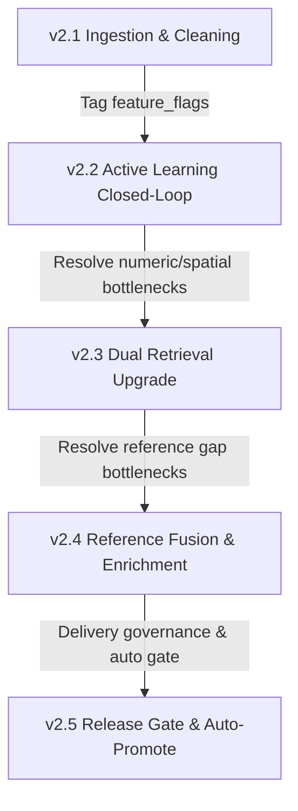

# AddressForge Next-Generation Evolution Roadmap (v2.2 - v2.5)
## Future Planning for Next-Gen Address Disambiguation Based on Core System Goals

> [!IMPORTANT]
> **Core System Priorities**:
> 1. Ensure high cleaning accuracy for Canadian residential and apartment addresses (House & Apartment), especially **unit number recall and error prevention**.
> 2. Avoid degrading the system into a simple "unit number extractor"; we must **protect single-family precision** and **maintain stable building type classification**.
> 3. Strictly follow closed-loop development principles. All evolutions must be driven by real data feedback, forming a loop of data backflow and active learning.

---

## 1. Roadmap & Milestones

Based on core system goals and the current v2.1 incremental cleaning pipeline status, the future evolution is planned as follows:

### Milestone Definitions Summary

| Version | Milestone Goals | Core Bottlenecks Addressed | Business/Operational Value |
| :--- | :--- | :--- | :--- |
| **v2.2** | **Active Learning & Closed-Loop Retraining** | Resolves skewed human Gold data (dominated by hardest cases) and slow iteration speeds. | **Active Learning Loop**: Filters and samples review queues using feature flags combined with ML disagreement audits to collect, freeze, retrain, and promote models seamlessly. |
| **v2.3** | **Dual Retrieval Upgrade (Vector + Spatial)** | Resolves vector embedding insensitivity to exact numeric differences (e.g., unit/street numbers like `101` vs `102`). | **Dual Recall (Vector + Spatial)**: Shifts database bedrock towards **PostgreSQL + pgvector + PostGIS** for combined dense vector and spatial circular query ($250\text{m}$) recall, reaching 99.9% matching accuracy. |
| **v2.4** | **Reference Fusion & Unit Library Enrichment** | Resolves `enrich` and `reject` route blocks caused by missing unit/building details for newly built complexes. | **Canonical Asset Growth**: Integrates external reference databases (Canada Post, GeoNova, etc.) using entity alignment, and backfills units dynamically from high-confidence delivery successes. |
| **v2.5** | **Shadow Evaluation & Auto-Promote Gate** | Resolves lack of real-world shadow verification and automated rollbacks before promoting candidate models. | **Unattended Model Promotion**: Evaluates sidecar health checks (such as F1 and disagreement rates) to automatically promote safe candidates or trigger instant safe rollbacks. |

---

## 2. Detailed Specifications

### 📅 v2.2: Active Learning Closed-Loop
- **Key Technical Details**:
  1. **Disagreement Audit**: Audits differences between heuristic decisions and CatBoost decisions, automatically enqueuing these edge cases for operator review.
  2. **Feature Flags Combination**: Automatically profiles and classifies the review queue using flags computed during cleaning (e.g., `has_double_number`, `is_numbered_road`, `has_explicit_unit`).
  3. **Freeze & Auto-Retraining Chain**: Once operators confirm Gold labels, triggers a one-click chain: "dataset freeze -> automated model retraining (for the three CatBoost models) -> release new candidate", preventing model drift.

### 📅 v2.3: Dual Retrieval Upgrade (Vector + Spatial)
- **Key Technical Details**:
  1. **PostGIS Spatial Indexing**: Circular query spatial buildings using `ST_DWithin` centered at the query's GPS coordinates, recalling building references within $250\text{m}$.
  2. **BM25 Lexical / Exact Match Path**: Adds hard numeric matching weights for Civic Numbers and Postal Codes, forcing CatBoost models to output steep probability drops between similar numbers like `101` and `102`.
  3. **FAISS/HNSWLib Upgrades**: Smoothly migrates local vector indexes to PG + pgvector or high-performance HNSW memory indexes.

### 📅 v2.4: Reference Fusion & Enrichment
- **Key Technical Details**:
  1. **Multi-Source Entity Fusion**: Integrates multiple reference sources (OSM, GeoNova, etc.) by grouping and deduplicating duplicates to resolve unique `building_key` identifiers.
  2. **Unit Mining**: Extracts valid unit numbers from historical deliveries with high acceptance rates and backfills them into the canonical unit library to lower future enrichment rates.

### 📅 v2.5: Shadow Verification & Promotion Gate (Shadow & Gate)
- **Key Technical Details**:
  1. **Registry Gate Verification**: Enforces consistency checks on model files (`.pkl`, `.json`, `.cbm`) before promoting candidates to candidate/default status.
  2. **Auto-Promote/Rollback Logic**: Promotes models automatically when candidates out-perform baselines on shadow traffic for 7 days. Reverts automatically to previous safe manifests if performance drops or latency spikes.
