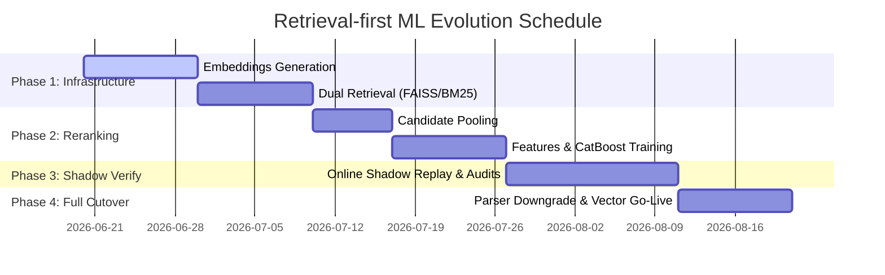

# AddressForge Retrieval-first ML Architecture Evolution Specification
## Next-Generation Address Intelligence System: Transition from Parser-first to Retrieval-first spec and tech evaluation

> **Status**: Architectural Evolution Evaluation and Design Specification  
> **Goal**: Evaluate and design the process of upgrading AddressForge from an engine driven primarily by rule-based parsing (Parser + Regex) to a next-generation system driven by "Dense Retrieval + Entity Resolution / ML Reranking".

---

## 1. Background & Core Bottleneck Analysis (Why We Need Transition)

In the current AddressForge (Phase 15-18) architecture, the core control flow is:
$$\text{Raw Address} \longrightarrow \text{Parser (Regex Extraction)} \longrightarrow \text{Generate Candidates} \longrightarrow \text{ML Reranking/Scoring} \longrightarrow \text{Decision Gating}$$

This architecture is called **"Parser-first"**. In actual production scenarios, it faces several major bottlenecks:

### 1.1 "First Gate Failure" Cascading Effect
- **Issue**: If the raw address input contains noise or non-standard format (e.g. `215-2761, Gladstone St` with a comma, or `unit 101 Remys nail and spa 599 King St` containing business names), the parsing stage (regex extraction) fails to split the string correctly.
- **Consequences**: The parser fails to extract the unit number (`unit_number`) and street number (`street_number`), which prevents the correct structured candidates from ever being generated.
- **ML Layer Ineffectiveness**: Downstream ML Reranker and Decision Model have to pick from a pool of broken/malformed candidates, leading the system to output `review` and overload human operators.

### 1.2 Overlooking the "Geospatial Entity" Nature of Addresses
- **Issue**: The Parser-first architecture treats address normalization as a **Text Sequence Labeling / Parsing** problem. However, in reality, raw address text is just a fuzzy, noisy representation of a physical three-dimensional entity (a building, an apartment) on earth.
- **Solution**: Address resolution should be approached as **Entity Alignment & Resolution**. The system should determine which canonical building and unit in our reference database matches the user's text description, rather than focusing purely on text segmentation.

---

## 2. Retrieval-first Architecture Design

To break through this ceiling, we propose a **"Retrieval-first"** architecture. The parsing rules are downgraded to "Feature Providers", while the system's core control flow centers around **Geospatial Entity Retrieval and Similarity Reranking**.

### 2.1 Core Control Flow Comparison

```mermaid
graph TD
    subgraph Old: Parser-first
        A[Input Raw Address] --> B[Regex/Parser Tokenization]
        B --> C[Generate Candidate Text Combinations]
        C --> D[ML Reranker Scoring]
        D --> E[Decision Gating]
    end

    subgraph New: Retrieval-first (Recommended)
        F[Input Raw Address] --> G[Lightweight Normalization]
        G --> H[Dual-Retrieval: Vector + Lexical Search]
        H --> I[Retrieve Top-K Standard Entities Canonical Buildings]
        I --> J[Candidate Feature Extraction]
        J --> K[CatBoost ML Pairwise Reranking]
        K --> L[Canonical Address Resolution]
        L --> M[Calibrated Decision Gating]
    end
```

### 2.2 Detailed Core Steps

#### Step 1: Lightweight Normalization
Performs basic spacing adjustment, casing normalization, and province/city extraction. It does not cut or split numbers or street names, keeping the original textual context intact.

#### Step 2: Dual-Retrieval (Hybrid Search)
To ensure high recall of canonical candidates, we implement a **Hybrid Search** strategy:
1. **Dense Vector Retrieval**: Converts the raw query to a dense vector using an embedding model and retrieves top-N standard buildings using a vector index (e.g. FAISS/pgvector). This tolerates typos, street suffixes variations, and word order changes.
2. **Sparse Lexical Retrieval**: Uses BM25 or database Full-Text Search (FTS) to retrieve top-M candidates based on exact numbers (e.g. civic number, postal code) to make sure hard numeric matches are not missed.

#### Step 3: Feature Engineering
Calculates multi-dimensional features for each of the top-$(N+M)$ candidates combined with the query:
- **Text Similarity**: Edit distance (RapidFuzz), text coverage, suffix match.
- **Geospatial Alignment**: Distances using coordinates and postal codes.
- **Parsing Assistance**: Runs `hybrid_canada` and `simple_rule` as feature providers, extracting features like `parser_confidence`, `unit_hint`, etc.

#### Step 4: ML Entity Resolution (Reranking)
Pipes the feature vectors into a CatBoost Reranker to predict matching probability (`same_entity = 0/1`).
- **Core Advantage**: Even if the parser fails to split `215-2761`, because the dual retrieval successfully recalls `2761 Gladstone St` as a candidate, CatBoost learns that "query contains 215", "query contains 2761", and "building has units" represent a high-confidence match.

#### Step 5: Canonical Address Resolution
Resolves the top ranked standard building, extracts its `building_id`, extracts the unit number using local regex or bare-number recovery rules, connects them with the canonical unit library, and outputs the final structured address.

---

## 3. Technology Stack Selection

To implement this architecture smoothly within the existing Python + MySQL + Docker stack, we select:

| Module | Recommended Technology | Evaluation Notes |
| :--- | :--- | :--- |
| **Parsing & Norm** | `libpostal` + `RapidFuzz` | Native `libpostal` is retained as a lightweight feature provider. `RapidFuzz` handles extremely fast C-based edit distance calculations. |
| **Embedding** | `BAAI/bge-small-en-v1.5` | Parameters are small (24M), CPU inference is fast, and it ranks high on the MTEB leaderboard. Perfect for short address strings. |
| **Vector DB** | `pgvector` (PostgreSQL) or **FAISS / HNSWLib** | **Migration path**: Uses Python-in-memory `FAISS` to store reference indexes in a Docker sidecar or on disk, eventually migrating the entire database to PostgreSQL + PostGIS. |
| **ML Ranker** | `CatBoost` | Retains CatBoost for tabular feature support and native Pairwise ranking objective functions. |

---

## 4. Evolution Roadmap & Phases

The evolution follows a phased, zero-downtime, shadow-validation approach:



### 4.1 Phase 1: Vector Index & Dual Retrieval (Recall)
- **Tasks**:
  1. Generate embeddings for all `canonical_building` entries using `bge-small-en-v1.5`.
  2. Implement an HNSW/FAISS index retrieval service.
  3. Combine FAISS vector results with FTS database results, deduplicating the candidates.
- **Exit Criteria**:
  - **Candidate Recall @ K=10**: The correct target entity is contained in the top-10 candidate pool for $\ge 99.5\%$ of Gold labels.

### 4.2 Phase 2: Reranker Feature Engineering & Model Training (Accuracy)
- **Tasks**:
  1. Extract training samples from `gold_label` and `historical_replay_result`.
  2. Build pairwise samples (1 positive candidate, 9 negative candidates).
  3. Train the CatBoost Reranker on alignment features.
- **Exit Criteria**:
  - **Mean Reciprocal Rank (MRR)**: $\ge 0.98$.

### 4.3 Phase 3: Shadow Verification (Validation)
- **Tasks**:
  1. Keep the Parser-first path active as the production writer.
  2. Run the Retrieval-first path asynchronously in a **Shadow Pipeline**.
  3. Record disagreement logs in `historical_replay_result` for operator audit.
- **Exit Criteria**:
  - **Latency Delta**: Clean latency increases by $\le 15\text{ms}$.
  - **Shadow Win Rate**: In case of decisions conflict, the new candidate is correct in $\ge 90\%$ of samples.

### 4.4 Phase 4: Full Cutover (Production)
- **Tasks**:
  1. Set the Retrieval-first path as the active production controller.
  2. Downgrade regex parsers to candidate feature providers.
  3. Wire human review updates to trigger automated training data backflow.

---

## 5. Feasibility & Risk Controls

### 5.1 Real-Time Embedding Latency
- **Control**: Use CPU-friendly quantized `bge-small-en` (FP16/INT8). Single query embedding time is controlled within $\le 5\text{ms}$ on standard CPU. Building reference embeddings are pre-calculated offline.

### 5.2 Numeric Matching Insensitivity
- **Control**: Combine dense vectors with Lexical BM25 paths. Include hard features like `zip_code_exactly_match` and `civic_number_exactly_match` in the CatBoost Reranker to enforce steep score penalties for wrong numbers.

### 5.3 Dynamic Index Refresh
- **Control**: Use index structures that support dynamic insertions (e.g. FAISS `IndexHNSWFlat`) to insert new references incrementally without rebuild overhead.
