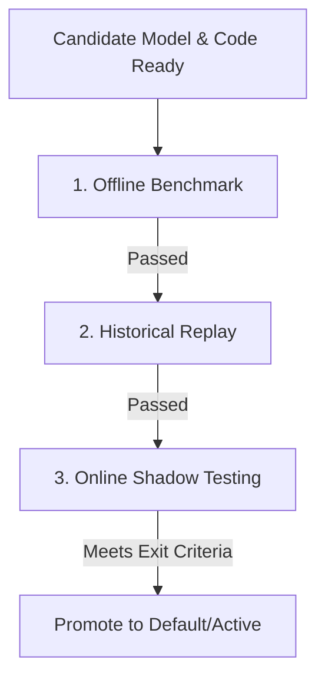

# AddressForge ML Pipeline Testing & Acceptance Metrics Framework
## System Upgrade and Milestone Release Acceptance Metrics & Testing Specifications

> [!IMPORTANT]
> **Acceptance Gate Principle**: Before any new version or candidate model goes live, it must never be promoted based purely on "small-sample check" or "subjective perception". It must pass the "Three-Dimensional Testing Workflow" (Offline Benchmark, Historical Replay, Online Shadow Testing) and satisfy the quantitative exit criteria in terms of the Trade-off between Decision Accuracy (Decision F1) and Operational Overhead (Review Rate).

---

## 1. Core Evaluation Metrics

The system performance updates are evaluated using three distinct metric buckets:

### 1.1 Model Quality Metrics
- **Decision F1 Score**:
  - *Definition*: Measures the overall classification accuracy of final decisions (`accept` vs `review` vs `reject`).
  - *Gate Requirement*: Core retrieval updates (like the v2.3 dual retrieval upgrade) require the Decision F1 on the Frozen Gold benchmark set to be **non-regressing and show improvement of $\ge +3.0\%$**.
- **Building Type F1 Score**:
  - *Definition*: Measures the accuracy of classifications across `single_unit` (houses), `multi_unit` (apartments), and `commercial` (business addresses).
  - *Gate Requirement*: Unit number recall improvements must not degrade structure classification. Building Type F1 must maintain a high level of **$\ge 0.97$**.
- **Unit Number Recall & Precision**:
  - *Definition*: The accuracy of extracting and backfilling apartment unit numbers (`unit_number`).
  - *Gate Requirement*: While improving recall, unit precision must remain **$\ge 98.0\%$** to avoid splitting street numbers into phantom unit numbers.

### 1.2 Operational Efficiency Metrics
- **Review Rate**:
  - *Definition*: The percentage of imported records routed to the manual/LLM review task queues.
  - *Gate Requirement*: While keeping Decision F1 stable or improved, the Review Rate must **decrease by $\ge 15\%$** (saving human operational resources).
- **Reject Rate**:
  - *Definition*: The percentage of malformed/junk addresses rejected automatically. Must remain stable to avoid false positive rejections.

### 1.3 Operational Performance Metrics
- **Disagreement Rate**:
  - *Definition*: The percentage of incoming records where candidate models and active models disagree.
  - *Gate Requirement*: During online shadow testing, the **win rate of candidate decisions on disagreements must be $\ge 90\%$**.
- **Average Cleaning Latency (Latency Delta)**:
  - *Gate Requirement*: The addition of vector lookup and feature extraction must limit average latency increases to **$\le 10\text{ms}$ per address** to prevent ETL worker logjams.

---

## 2. Three-Dimensional Testing Workflow

In each milestone version cycle, the candidate must pass the following validation pipeline:

### 2.1 Step 1: Offline Benchmark
- **Method**: Run `python3 scripts/run_latest_eval.py` over the latest Frozen Gold benchmark dataset.
- **Audits**: Compare confusion matrices, F1 changes per category, and examine specific edge cases on single/multi-unit boundaries.

### 2.2 Step 2: Historical Replay
- **Method**: Extract 100,000+ real production records from `raw_address_record` imported over the last 3 months, and rerun them in a local replay workspace.
- **Audits**: Calculate Disagreement Rates, export disputed cases, and audit them via LLM/human sampling to confirm no local overfitting.

### 2.3 Step 3: Online Shadow Testing
- **Method**: Deploy the new model version as a Candidate. Background workers evaluate incoming production traffic (`shadow_assist`) without writing or affecting production values.
- **Duration**: Shadow testing must run continuously for **7 to 14 days** starting from v2.2.
- **Audits**: Measure production latency under high concurrency, inspect database lock contentions, and verify candidate cumulative win rates on disagreements.

---

## 3. Exit Criteria Matrix

| Milestone Version | Focus Area | Exit Criteria Thresholds |
| :--- | :--- | :--- |
| **v2.2 (Active Learning Loop)** | 1. Disagreement audit accuracy. 2. Active learning tag correctness. | - Disagreement export accuracy $\ge 98.0\%$. - Tagging latency $\le 1\text{ms}$ per record. - Auto-training pipeline trigger time $\le 30\text{s}$. |
| **v2.3 (Dual Retrieval Upgrade)** | 1. Hybrid Search Recall@10. 2. Exact numeric match guard. | - Hybrid Recall@10 $\ge 99.5\%$ (baseline: 98.2%). - Vector search latency $\le 8\text{ms}$. - Numeric street number matching accuracy delta $\ge +1.5\%$. |
| **v2.4 (Reference Fusion)** | 1. Entity alignment correctness. 2. Mined unit number recall. | - Duplicate entity fusion accuracy $\ge 99.0\%$. - Review rate reduction due to unit mining $\ge 8.0\%$. |
| **v2.5 (Shadow Gate)** | 1. Shadow testing 14-day metrics. 2. Rollback latency validation. | - 0 crashes during 14-day shadow testing. - Per-request latency increase $\le 10\text{ms}$. - Shadow win rate on disagreements $\ge 92.0\%$. - Rollback execution time $\le 5\text{s}$. |
