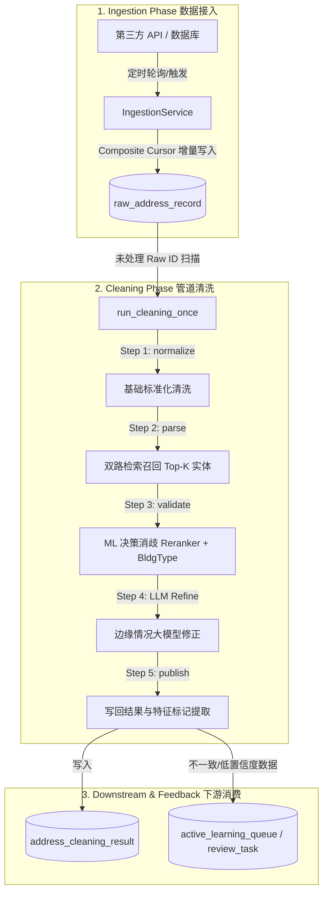

# AddressForge Ingestion & Automated Cleaning Pipeline Evolution Specification
## 第三方定期导入新数据高精度 ML 清洗流水线技术规约与架构文档

> **文档性质**：系统架构与设计规约  
> **文档目标**：面向定期从第三方系统（API/数据库）批量或增量导入的原始地址数据，定义在 Retrieval-first 下一代架构中的数据接入、管道清洗、ML 模型校准与安全保障规范。

---

## 1. 业务背景与挑战 (Context & Challenges)

随着 AddressForge 的核心 Normalize/Validate 接口模型升级，后端的定期/定时新数据清洗管道（Ingestion & Cleaning Pipeline）必须同步对齐最新的 ML 决策政策。第三方接口导入的原始数据面临以下核心挑战：

1. **高噪音输入**：第三方订单数据常伴有手写缩写、多重单元标识符（如 `Apt 2B-3`）、商家名称以及由于城市行政区划或法文拼写导致的匹配假阳性（如 `Grand Pre` vs `North Grand Pré`）。
2. **数据规模与吞吐**：数据周期性批量导入（每次数千至数万条），如果完全抛给人工审核（`review`），会造成运营队列严重积压。
3. **解析级联退化**：如果解析器（Parser）首关分词失败，旧架构下决策层无法恢复正确信息。

因此，增量导入数据清洗管道必须以 **“检索优先（Retrieval-first）+ ML 重排（CatBoost Reranker）+ 建筑类型校准（BuildingType Model）+ 局部 LLM 细化（LLM Refiner）”** 为核心支撑。

---

## 2. 管道流水线架构设计 (Ingestion & Cleaning Pipeline Architecture)



### 2.1 增量数据接入 (Incremental Ingestion Service)

`IngestionService` 支持两种主流的第三方数据源模式：
1. **API 拉取模式 (API Ingestion)**：
   - 依赖 `LegacyBatchOrdersApiAdapter` 进行特定分部（Branch）和批次列表（Batch List）的数据拉取。
   - 为避免接口鉴权过期或不兼容导致 401 报错，支持静态批次覆盖机制 `ADDRESSFORGE_INGESTION_BATCH_LIST_OVERRIDE`，绕过动态发现接口，直接并发获取驱动和订单数据。
2. **数据库直连模式 (Database Ingestion)**：
   - 采用基于 `updated_at` 和 `external_id` (或 `order_id`) 的**复合游标分页技术（Composite Cursor Pagination）**，避免传统 `LIMIT OFFSET` 在大数据量下的深分页性能退化及漏数据风险。
   - 游标状态记录在 `source_ingestion_cursor` 中，确保即使任务中断也能从上一次成功的断点增量恢复。

### 2.2 人工触发与自动任务链 (Manual Triggers & Job Chains)

* **人工触发模式 (Manual Trigger Mode)**：为保证线上导入频次及数据源变动的安全性，系统默认**禁用自动轮询模式（`continuous_mode.enabled = false`）**。数据导入完全由人工（通过控制台后台任务提交、API 调用或执行特定命令脚本）按需触发产生 `ingestion_once` 任务。
* **自动跟随清理 (Follow-up Cleaning)**：在人工成功触发的 `ingestion_once` 执行成功且 `records_ingested > 0` 时，系统依据 `pipeline.auto_clean.enabled = true` 设置，自动在 `control_job` 队列中以较低优先级排队一个 `cleaning_once` 任务，确保新导入的数据能够在几分钟内自动清洗完成。

### 2.3 ML 实体对齐与自动决策 (ML Entity Resolution & Decision Flow)

在 `run_cleaning_once` 核心循环中，对每一条新数据执行以下精细化决策流：

1. **首关双路检索召回**：输入 Query 经过标准化后，分发给 `VectorRetrievalGateway`（基于 `bge-small-en-v1.5` 的局部 HNSW 向量库）和字面 `simple_rule`/`BM25` 检索，混合召回 Top-K 建筑物实体。
2. **CatBoost 多模型消歧**：
   - **Reranker** 对混合召回的候选进行语义和数值对准度打分排序，寻找最优对齐标准实体。
   - **Decision Model** 计算当前最优匹配的置信度。若系统在 `assist_trial` 模式下运行，高概率的 ML 预测值可以覆盖低置信度的启发式拦截，降低人工审核比例。
   - **BuildingType Model** 检查建筑类型。当启发式判断为 `multi_unit` 但分类器以极高置信度（如 $\ge 0.85$）指示 `single_unit` 时，执行**强力类型覆盖**（`bt_override_applied = true`），自动去除无意义的单元号，防止假阳性拦截。
3. **主动特征标记提取 (Feature Flags Extraction)**：
   清洗成功发布前，必须提取并落地物理结构标志位，包含：
   - `has_double_number`（检测类似双地址数值边界）
   - `is_numbered_road`（编号公路）
   - `has_explicit_unit`（显式单元词）
   这些特征标志将成为后续**主动学习（Active Learning）战略抽样**的重要过滤器。

---

## 3. 数据实体与表关系规约 (Database Schema Relationships)

清洗流水线涉及的数据库表实体关系如下：

```
+------------------------+      1      +--------------------------+
|  raw_address_record    |------------>| address_cleaning_result  |
|                        |             |                          |
|  - raw_id (PK)         |             | - raw_id (FK, Unique)    |
|  - raw_address_text    |             | - decision (accept/rev)  |
|  - source_cursor       |             | - building_type          |
|  - is_active = 1       |             | - feature_flags          |
+------------------------+             | - validation_json (ML)   |
            ^                          +--------------------------+
            | 1..* (ETL Import)
+------------------------+
|      control_job       |
|                        |
|  - job_id (PK)         |
|  - job_kind            |
|  - status              |
|  - payload_json        |
+------------------------+
```

---

## 4. 关键设计原则与安全策略 (Development & Operational Principles)

在开发与迭代导入管道时，必须严格遵守以下原则：

1. **绝对防线：不要直接转录 LLM 输出为人工 Gold**  
   - LLM 细化组件（`llm_refiner`）提供的建议，在落库时其来源字段必须标记为 `llm_draft` 或 `silver_label`，**绝不允许**将 `label_source` 标记为 `human`。任何用于模型微调或 release 门禁的测试集必须经过人工确认。
2. **复合游标状态完整性**  
   - 游标值写入和更新应当具有原子性，执行批量 `ON DUPLICATE KEY UPDATE` 以防止并发状态脏写。
3. **日志溯源标准**  
   - 所有运行时对决策的 ML 覆盖或强力类型转换（如 `shadow_assist`，`Guarded Override`）必须在 `validation_json` 及 `worker.log` 中输出精确的特征得分和模型参数信息，以备 shadow 重放审计。
