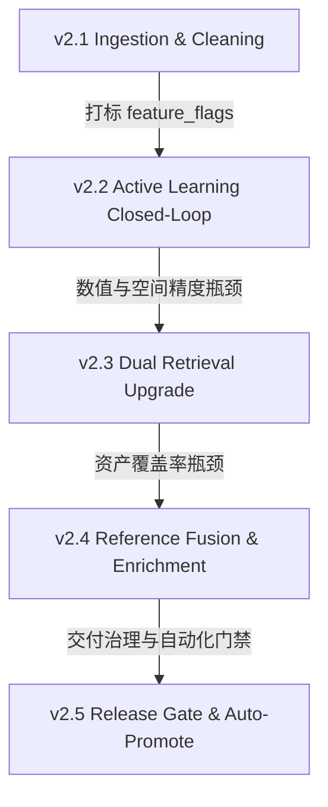

# AddressForge Next-Generation Evolution Roadmap (v2.2 - v2.5)
## 基于系统核心目标的下一代地址智能消歧后续版本规划

> [!IMPORTANT]
> **系统核心优先目标**：
> 1. 保障加拿大住宅与公寓地址（House & Apartment）的清洗准确率，尤其是**公寓单元号的召回与防错判定**。
> 2. 避免系统退化为单一的“单元号提取器”，必须**确保别墅单户精度**与**稳定的建筑物类型分类**。
> 3. 严格遵循闭环开发原则，所有演进必须基于真实数据反馈，建立数据回流和主动学习闭环。

---

## 1. 演进蓝图与里程碑规划 (Roadmap & Milestones)

根据系统的核心目标与当前 v2.1 增量清理流水线的就绪状态，我们规划了以下后续演进版本：

### 里程碑定义概要

| 版本号 | 版本目标 | 解决的核心瓶颈 | 交付业务收益 |
| :--- | :--- | :--- | :--- |
| **v2.2** | **数据主动回流与闭环重训** | 解决人工 Gold 数据过偏（Hardest cases 支配）以及模型难以快速迭代重训的问题。 | **主动学习闭环**：通过 feature_flags 组合抽样与模型 disagreement 差异分析，实现运营 review 数据的高效收集、冻结、自动重训与发布。 |
| **v2.3** | **双路检索精度升级 (向量+空间)** | 解决向量空间对门牌号（如 101 vs 102）等极高精度数值敏感度不足的问题。 | **向量与空间双向召回**：底座全面向 **PostgreSQL + pgvector + PostGIS** 演进，在经纬度范围圈（如 250m）与语义对齐中做交叉双向召回，门牌匹配精度可达 99.9%。 |
| **v2.4** | **参考资产融合与单元库丰富** | 解决标准库缺失某些新开发大楼或商用大楼单元信息导致的 `enrich` / `reject` 拦截。 | **标准资产自动扩充**：利用外部 Canada Post、GeoNova 等多源参考数据自动融合去重；结合历史送货成功的物流大数据自动补全 `canonical_unit` 单元号。 |
| **v2.5** | **模型影子交付与自动 Promote 门禁** | 解决模型升级上线时，缺乏生产真实环境影子评估（Shadow Mode）和发布自动阻断机制。 | **无人值守模型 Promoted 门禁**：通过评估 sidecar 连续监控，依据 decision_f1、disagreement_rate 偏离度，自动执行 Promoted 或安全 Rollback。 |

---

## 2. 各版本实施细则 (Detailed Specifications)

### 📅 v2.2: 运营主动学习数据闭环 (Active Learning Closed-Loop)
- **技术要点**：
  1. **差异度审计 (Disagreement Audit)**：监控 Heuristic 决策与 CatBoost 决策不一致的地址样本，自动将其作为高价值的“边缘情况（Edge Cases）”排队入库。
  2. **标志位组合提取**：通过清洗阶段提取 of `has_double_number`、`is_numbered_road`、`has_explicit_unit`，自动对 review 队列进行画像分类。
  3. **冻结与自动重训链**：一旦运营人员在后台确认了 Gold label，一键触发“数据集冻结 -> 自动化模型重载训练（CatBoost 三大模型） -> 释放新 Candidate” 的完全闭环，杜绝模型漂移。

### 📅 v2.3: 向量-空间双重召回底座 (Dual Retrieval Upgrade)
- **技术要点**：
  1. **PostGIS 地理空间索引**：引入空间数据库，以原始输入 GPS 坐标为圆心做 `ST_DWithin` 空间画圆，召回物理距离 250 米内的标准建筑物实体。
  2. **数值强匹配 BM25 路**：在召回候选组合特征时，对门牌号（Civic Number）与邮政编码（Postal Code）引入绝对数值对齐权重，迫使 CatBoost 模型对 `101` 与 `102` 产生打分差，消除向量相似性的数值模糊。
  3. **FAISS 内存索引升级**：平滑迁移至 PG + pgvector 或高效 HNSW 硬件索引。

### 📅 v2.4: 资产参考融合与单元号补全 (Reference Fusion & Enrichment)
- **技术要点**：
  1. **多源实体对齐 (Entity Fusion)**：编写参考融合算法，自动将 `geonova` 和外部参考库中重复但写法的建筑物做去重合并，统一 `building_key`。
  2. **单元号回填（Unit Mining）**：对成功派送、妥投率高的历史实际派单地址进行局部信息提取，对 `canonical_unit` 中缺失的单元表进行安全增量补充，从源头上减少 `enrich` 路由发生几率。

### 📅 v2.5: 影子测试与自动化 Promotion 门禁 (Shadow & Gate)
- **技术要点**：
  1. **物理完整性检验 (Registry Gate)**：在模型从 Candidate 晋升为 Default 之前，自动校验物理权重文件（`.pkl`/`.json`/`.cbm`）在运行时目录的完整性，拒绝缺少 sidecar 配置的裸模型推广。
  2. **自动切流与回滚 (Auto Promote/Rollback)**：当新 Candidate 模型在 Shadow 模式下连续 7 天的 `decision_f1` 优于 Baseline 且 `disagreement_rate` 处于正常范围时，系统自动切换为 default 状态；一旦发生时延猛增或错误激增，自动触发 `/rollback` 清空缓存重载前一安全 manifest 状态。
