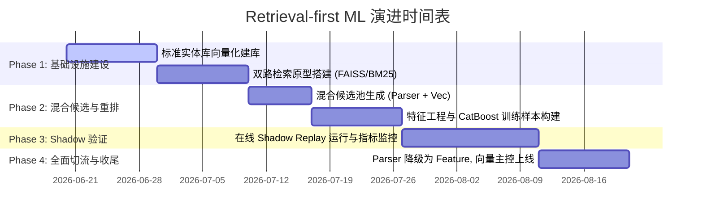

# AddressForge Retrieval-first ML Architecture Evolution Specification
## 下一代地址智能系统：从解析优先（Parser-first）到检索优先（Retrieval-first）演进方案与技术评估文档

> **文档性质**：架构演进评估与设计规范  
> **文档目标**：评估并设计将 AddressForge 从以规则解析器（Parser + Regex）为主导的架构，升级为以“向量检索 + 实体消歧重排（Retrieval-first + Entity Resolution）”为主导的下一代智能化地址处理系统。

---

## 1. 背景与核心瓶颈分析（Why We Need Transition）

在目前的 AddressForge (Phase 15-18) 架构中，系统的核心控制流为：
$$\text{原始地址} \longrightarrow \text{Parser (正则提取)} \longrightarrow \text{生成候选} \longrightarrow \text{ML重排/打分} \longrightarrow \text{决策拦截}$$

该架构被称为 **“解析优先（Parser-first）”**。在实际业务场景中，该架构正面临难以逾越的性能和精度天花板：

### 1.1 “首关失败”级联效应（Parser Cascading Failure）
* **瓶颈表现**：如果输入地址包含非标手写、多余标点或噪音（例如 `215-2761, Gladstone St` 中的逗号，或者 `unit 101 Remys nail and spa 599 King St` 中的商家名称），解析层的正则表达式分词会直接失败。
* **后果**：解析器未能正确切分出单元号（`unit_number`）与门牌号（`street_number`），导致在第一步生成候选池时，**正确的结构化组合根本无法被创建出来**。
* **ML层无力回天**：中下游的 ML Reranker 和 Decision Model 只能在“错误/残缺”的候选池中做选择，巧妇难为无米之炊，系统最终只能将地址判定为 `review` 并抛给人工审核，造成审核 backlog 积压。

### 1.2 忽略了地址的“地理实体（Geospatial Entity）”本质
* **瓶颈表现**：Parser-first 架构将地址处理视作**文本序列标注（Text Parsing）**问题。但现实中，输入的文本只是对地球上某个三维空间实体（如一栋大楼、一个商铺）的“模糊描述”。
* **解决方向**：地址处理的本质应当是**实体对齐与消歧（Entity Resolution）**。系统应当回答：“用户的输入文本，最像我们物理世界数据库里的哪栋楼、哪个单元？”而不是仅仅关注文本怎么切分。

---

## 2. 检索优先（Retrieval-first）架构设计

为打破上述天花板，我们提出 **“检索优先（Retrieval-first）”** 架构。新架构下，解析器（Parser）不再是系统的主控制器，而是降级为“特征提供方（Feature Provider）”。系统以**地理实体检索与相似性计算**为中心。

### 2.1 核心控制流对比

```mermaid
graph TD
    subgraph 旧架构: Parser-first
        A[输入原始地址] --> B[正则/Parser分词]
        B --> C[生成候选文本组合]
        C --> D[ML Reranker 排序]
        D --> E[决策层 Decision]
    end

    subgraph 新架构: Retrieval-first (推荐)
        F[输入原始地址] --> G[轻量清洗 Normalization]
        G --> H[双路检索 Dual-Retrieval: 向量检索 + 倒排检索]
        H --> I[检索出 Top-K 标准实体 Canonical Buildings]
        I --> J[候选特征生成 Features Extraction]
        J --> K[CatBoost 实体对齐重排 ML Ranking]
        K --> L[标准地址对齐 Canonical Resolution]
        L --> M[置信度决策 Decision Calibration]
    end
```

### 2.2 关键处理步骤详述

#### 步骤 1：轻量清洗与标准化 (Normalization)
仅进行基础的空格收紧、大写转换、省份/城市标准化提取。不对门牌号、路名、单元号进行强行切割，保留原始文本的整体语境。

#### 步骤 2：双路检索 (Dual-Retrieval)
为确保检索的高召回率，采用**双路召回（Hybrid Search）**策略：
1. **语义向量路（Dense Vector Retrieval）**：将输入地址通过 Embedding 模型转化为稠密向量，在标准建筑物实体库（`canonical_building`）的向量索引中检索前 $N$ 个最相似的实体。能够包容拼写错误、路名变体和部分语序颠倒。
2. **文本字面路（Sparse Lexical Retrieval）**：使用 BM25/FTS（如 MySQL FTS 或 Elasticsearch/Postgres FTS），基于文本字面（如邮编、门牌、路名分词）检索前 $M$ 个候选。确保数值高度一致的硬匹配地址不被漏掉。

#### 步骤 3：候选特征生成 (Feature Engineering)
将召回的 Top-$(N+M)$ 个标准建筑物实体与输入 Query 进行交叉，计算多维特征向量：
* **文本相似度**：编辑距离（RapidFuzz）、字面对齐度、拼写校正距离。
* **物理地理对齐**：若 Query 包含邮编，计算候选实体与邮编的物理距离（结合 PostGIS 或经纬度范围）。
* **解析辅助特征**：调用现有的 `hybrid_canada` 和 `simple_rule` 作为特征辅助，提供如 `parser_confidence`、`unit_hint`、`has_explicit_unit` 等信号。

#### 步骤 4：ML 实体消歧重排 (ML Ranking)
将特征向量送入 CatBoost Reranker，训练一个 **Pairwise Ranker** 或 **Binary Classifier**，预测 Query 与 Candidate 是否指向同一个物理实体（`same_entity = 0/1`）。
* **核心优势**：即使解析器未能完美切分 `215-2761`，由于双路检索召回了 `2761 Gladstone St` 这个标准实体，CatBoost 可以通过“输入包含 215”、“输入包含 2761”、“输入包含 Gladstone”、“候选实体是多单元”等特征组合，强力学出这二者是高置信度匹配的。

#### 步骤 5：标准地址对齐 (Canonical Resolution)
根据排序第一的候选标准建筑物，提取其 `building_id`，并从输入文本中提取对应的单元号（利用局部正则或 bare number 恢复规则），与标准单元库 `canonical_unit` 关联，输出完整的结构化标准地址。

---

## 3. 技术栈选型评估 (Technology Stack Selection)

为了在当前 AddressForge 的物理环境（基于 Python + MySQL + Docker）中平滑实现此演进，推荐以下技术选型：

| 模块 (Module) | 推荐技术 (Recommended Tech) | 评估说明 (Evaluation Notes) |
| :--- | :--- | :--- |
| **Parsing & Norm** | `libpostal` + `RapidFuzz` | 现有的 `libpostal` 封装保留，作为轻量特征提供器；使用 `RapidFuzz` 进行极速的 C 优化级编辑距离计算。 |
| **Embedding** | `BAAI/bge-small-en-v1.5` | **首选模型**。参数量小（仅 24M），推理极快（CPU可用），且在 MTEB 语义检索榜单上表现优异，极度适合地址这种短文本语义对齐。 |
| **Vector DB** | `pgvector` (PostgreSQL) <br>或 **FAISS / HNSWLib** | **平滑过渡方案**：如果维持 MySQL 数据库暂不动，可在 Python 内存中使用 `FAISS` / `HNSWLib` 维护标准建筑物向量索引，或在 MySQL 侧部署轻量级 Milvus/Chroma 作为 Sidecar 容器。<br>**最终目标**：系统底座逐步向 PostgreSQL + PostGIS 迁移。 |
| **ML Ranker** | `CatBoost` | **继续沿用并加深**。CatBoost 对结构化特征（对齐度、物理距离、离散型匹配度）支持极佳，天然抗过拟合，且原生支持 Pairwise Ranking 目标函数。 |

---

## 4. 演进路线图与阶段性指标（Phases of Evolution）

为降低系统重构风险，演进应遵循“数据闭环不中断、双系统平滑过渡、Shadow模式验证”的原则，分四阶段实施：



### 4.1 Phase 1：向量索引建设与双路检索（打通召回）
* **工作内容**：
  1. 离线使用 `bge-small-en-v1.5` 批量计算所有 `canonical_building` 表中标准地址的 Embedding。
  2. 搭建基于内存 FAISS 索引的检索服务（或新增向量数据库 Sidecar）。
  3. 实现双路检索：给定原始地址，同时输出 Parser 候选、FTS 文本候选、Vector 向量候选，并合并去重。
* **阶段评估指标**：
  * **候选覆盖率（Candidate Recall @ K=10）**：检查历史 Gold 数据中，正确标准实体包含在 Top-10 候选集中的比例，目标 $\ge 99.5\%$。

### 4.2 Phase 2：重排器特征工程与模型训练（优化精度）
* **工作内容**：
  1. 抽取历史 `gold_label` 与 `historical_replay_result` 作为训练集。
  2. 构建 `same_entity` (0/1) 标注的 Pairwise 样本（每个输入 Query 对应 1 个正样本和 9 个负样本候选）。
  3. 引入多维对齐特征，训练 CatBoost 排序模型，取代原有的简单 `weight_calibration`。
* **阶段评估指标**：
  * **排序准确率（Reranker Mean Reciprocal Rank - MRR）**：目标 $\ge 0.98$。

### 4.3 Phase 3：Shadow Verification（影子验证）
* **工作内容**：
  1. 保持现有 Parser-first 主流程负责线上正常决策。
  2. 开启后台异步的 **Shadow Pipeline**，使用 Retrieval-first 架构并行解析流入 of 地址。
  3. 将两路输出写入 `historical_replay_result`，计算 disagreement_rate，对发生不一致的样本进行人工/LLM审计。
* **阶段评估指标**：
  * ** shadow 运行时间差（Latency Delta）**：单条地址平均解析耗时增加 $\le 15\text{ms}$。
  * **不一致样本中新架构胜出率（Shadow Win Rate）**：在发生不一致的样本中，验证新架构解析正确的比例 $\ge 90\%$。

### 4.4 Phase 4：完全切流（正式上线）
* **工作内容**：
  1. 将 Retrieval-first 架构切为主控制流。
  2. 将原有 Parser 代码重构降级为“候选文本对齐度特征计算器”。
  3. 彻底闭环：将人工 Review 修正回流的数据，作为 `same_entity = 1` 的增量样本，实现在线主动学习（Active Learning）。

---

## 5. 关键可行性评估与潜在风险 (Risk & Feasibility)

### 5.1 向量计算的性能开销与延迟控制 (Latency)
* **评估**：地址数据流量大时，实时计算 Embedding 可能会造成 CPU 压力。
* **对策**：使用 CPU 友好、轻量化的 `bge-small-en` (FP16/INT8 量化)。单次 Embedding 推理在普通 CPU 上耗时应控制在 $\le 5\text{ms}$；对于数据库侧的 `canonical_building`，其 Embedding 在建库和增量同步时**离线计算好并落库**，线上检索只需计算 Query 的单个 Embedding。

### 5.2 邮编/数值型信息的强匹配退化
* **评估**：向量空间在处理极度精确的数值（如门牌号 `101` vs `102`，邮编 `B3K 0C4` vs `B3K 0C5`）时，可能会由于语义相近而在余弦相似度上区分度不够，导致召回的候选混淆。
* **对策**：必须坚持**双路检索**与**显式数值特征**。CatBoost 排序特征中必须包含硬规则匹配项（如 `zip_code_exactly_match`，`civic_number_exactly_match`）。一旦字面路（BM25/FTS）命中精确数值，需在打分时给予强力惩罚/加分，确保精度不退化。

### 5.3 增量同步与索引刷新
* **评估**：当有新的 `canonical_building` 或参考资产导入时，向量索引需要实时刷新。
* **对策**：采用支持动态插入的索引结构（如 FAISS 的 `IndexHNSWFlat` 或向量数据库自带的实时更新机制），避免每次修改都进行全量全建。

---

## 6. 后续行动指南（Immediate Next Step Suggestions）

对于系统当前的优化工作，建议：
1. **短期战术**：针对当前 review 阻塞的 16 条地址，继续优化 `common.py` 中的规则解析器（如支持逗号分隔、倒序格式），确保现有系统能够自动清理积压，不影响正常迭代。
2. **中期战略**：批准此【Retrieval-first】方案。启动 Phase 1 向量基础设施搭建，利用 `scripts/` 下的脚本（仿照 `train_reranker_model.py` 的架构）先行离线生成建筑物 Embeddings 并测试 Recall@10 覆盖率。
