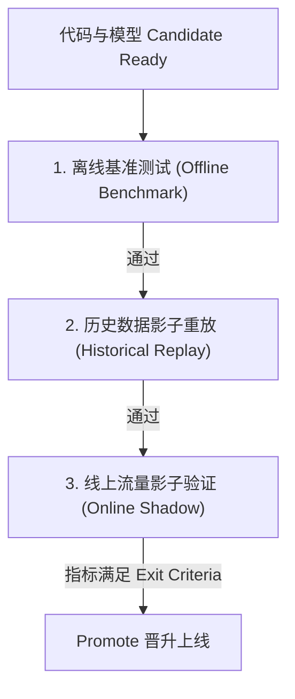

# AddressForge ML Pipeline Testing & Acceptance Metrics Framework
## 系统升级与后续版本上线验收指标与测试规约

> [!IMPORTANT]
> **验收防线原则**：任何新版本、新模型上线前，绝不能仅依靠“小样本测试”或“主观直觉”宣布成功。必须通过本规约定义的“三维测试法”（离线基准测试、历史重放测试、线上影子验证），并在决策准确率（Decision F1）与人工审核率（Review Rate）的权衡（Trade-off）中达到量化出口标准，方可准予 Promotion（晋升）。

---

## 1. 核心评估指标体系 (Core Evaluation Metrics)

系统改良提升效果主要通过三类指标进行闭环验收：

### 1.1 核心 ML 质量指标 (Model Quality Metrics)
* **决策 F1 分数 (Decision F1)**：
  - *定义*：衡量系统最终决策（`accept` vs `review` vs `reject`）的分类准确率。
  - *目标*：主干网络升级（如 v2.3 双路检索）后，要求离线 Gold 基准集上的 Decision F1 **无回归且提升 $\ge +3.0\%$**。
* **建筑类型 F1 分数 (Building Type F1)**：
  - *定义*：评估 `single_unit`（别墅单户）、`multi_unit`（公寓多单元）和 `commercial`（商业地址）分类的准确率。
  - *防线要求*：单元号召回的提升绝不能以牺牲建筑类型 classification 为代价，F1 必须维持在 **$\ge 0.97$** 的高水平。
* **单元号召回率与精确率 (Unit Number Recall & Precision)**：
  - *定义*：针对实际是 Apartment 的地址，提取并召回单元号（`unit_number`）的准确性。
  - *目标*：提升召回率的同时，精确率（防止把门牌号错切成单元号）必须保持在 **$\ge 98.0\%$**。

### 1.2 运营与商业效率指标 (Operational Efficiency Metrics)
* **人工审核率 (Review Rate)**：
  - *定义*：被路由到人工/LLM审核任务队列的订单比例。
  - *目标*：在保持 Decision F1 稳定的前提下，Review Rate 必须**下降 $\ge 15\%$**（释放运营资源）。
* **自动拒绝率 (Reject Rate)**：
  - *定义*：被判定为垃圾/坏地址直接拒绝的比例，应维持在稳定区间，防止假阳性误伤。

### 1.3 管道运行与系统时延指标 (Operational Performance Metrics)
* **影子一致率与不一致率 (Disagreement Rate)**：
  - *定义*：Candidate 模型与 Active 模型对同一条流量给出的决策不一致的比例。
  - *要求*：上线前不一致率应控制在合理的渐进范围内，且**在发生不一致的样本中，新架构胜出率 $\ge 90\%$**。
* **平均清洗延迟变动 (Latency Delta)**：
  - *要求*：引入向量检索和特征交叉后，单条地址的平均清洗延迟增加**必须 $\le 10\text{ms}$**，以防在批量导入时造成严重的 ETL 任务堆积。

---

## 2. 三维测试与验证规约 (Three-Dimensional Testing Workflow)

在每个里程碑版本生命周期内，必须执行以下三维验证流以完成验收：

### 2.1 步骤一：离线基准测试 (Offline Benchmark)
* **测试方法**：使用最新的 Frozen Gold 标签数据集作为测试集，执行 `python3 scripts/run_latest_eval.py`。
* **校验内容**：新旧模型的混淆矩阵对比、各分类项的 F1 变动、以及在别墅与公寓边界地址上的表现。

### 2.2 步骤二：历史数据影子重放 (Historical Replay)
* **测试方法**：从 `raw_address_record` 抽取最近 3 个月导入的 100,000+ 条真实生产数据，在本地开发环境进行批量影子重放。
* **校验内容**：统计不一致率（Disagreement Rate），并将发生分歧的地址单独导出，利用 LLM / 人工抽样核对哪一方更为准确，证明模型不是局部过拟合。

### 2.3 步骤三：线上流量影子验证 (Online Shadow Testing)
* **测试方法**：将新版本模型部署为 Candidate，由 Worker 在后台默默监听真实流量并记录 `shadow_assist` 数据，但不实际接管线上控制。
* **验证周期**：v2.2 之后必须连续跑 **7 至 14 天**。
* **校验内容**：在实际高并发网络与数据库竞争环境下的时延、系统负载，并最终核对 7 天内的累积不一致率胜出度。

---

## 3. 里程碑版本验收指标矩阵 (Exit Criteria Matrix)

| 里程碑版本 | 验收测试重点 | 核心通过指标 (Exit Criteria Thresholds) |
| :--- | :--- | :--- |
| **v2.2 (数据主动回流)** | 1. 差异度自动审计准确率。 2. 特征打标覆盖度。 | - 差异样本导出正确率 $\ge 98.0\%$。 - 标志位打标耗时 $\le 1\text{ms}$/条。 - 自动重训流水线触发时间 $\le 30$ 秒。 |
| **v2.3 (双路检索升级)** | 1. GPS + Embedding 混合检索 Recall@10。 2. 数值硬匹配阻断率。 | - 混合检索 Recall@10 $\ge 99.5\%$（基准：98.2%）。 - 向量检索耗时 $\le 8\text{ms}$。 - 门牌号匹配精度提升 $\ge +1.5\%$。 |
| **v2.4 (参考资产融合)** | 1. 实体对齐一致性（防重叠率）。 2. 补充单元召回提升。 | - 重复标准实体识别准确率 $\ge 99.0\%$。 - 由于补充单元带来的 review 率下降度 $\ge 8.0\%$。 |
| **v2.5 (影子交付门禁)** | 1. 影子测试 14 天平稳指标。 2. 异常回滚触发率。 | - 影子运行 14 天无崩点。 - 单单时延增加值 $\le 10\text{ms}$。 - 不一致胜出率 $\ge 92.0\%$。 - 回滚超时控制在 $\le 5$ 秒以内。 |
