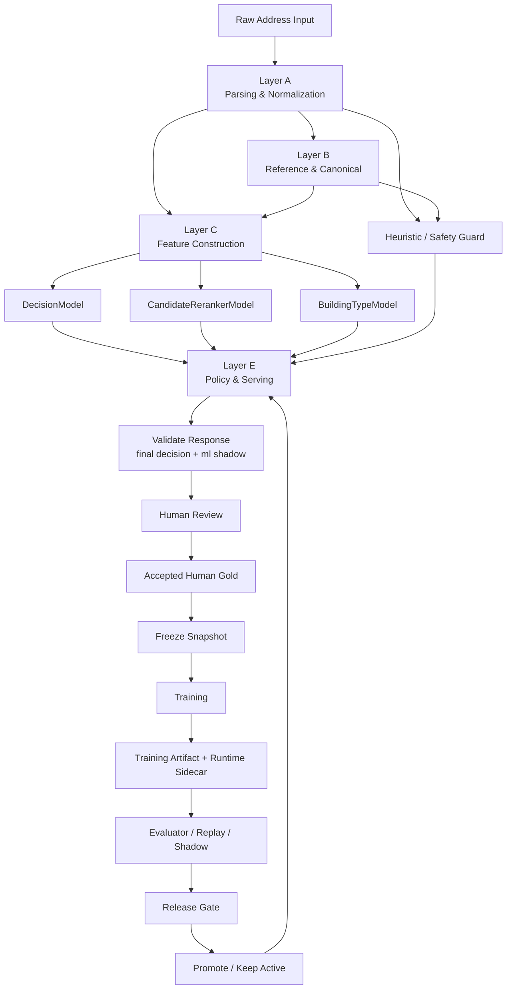
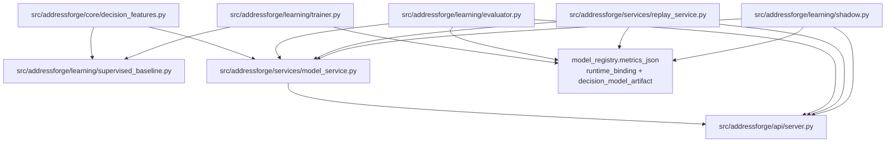
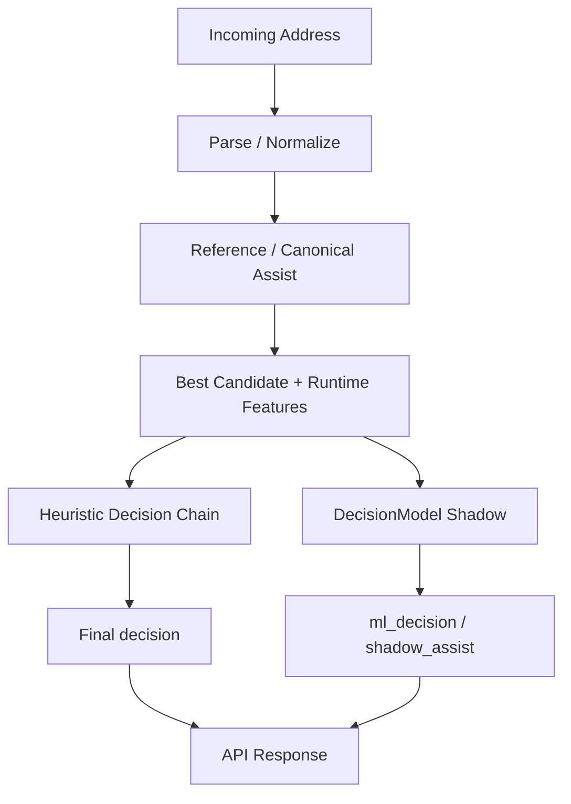
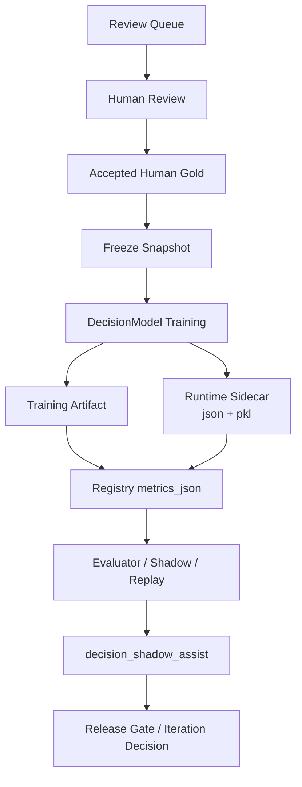
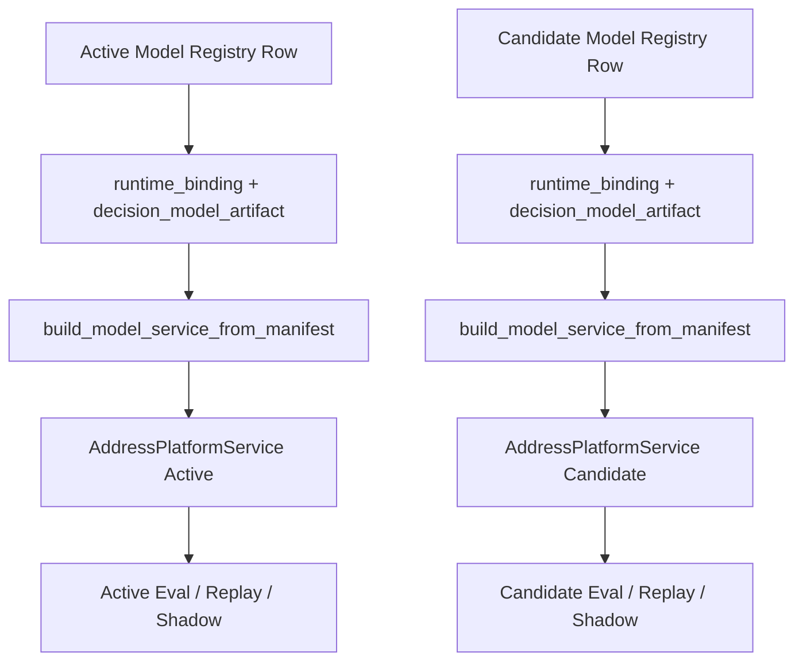

# AddressForge 下一代机器学习系统设计文档

## 1. 文档信息
- 文档类型：System Design
- 主题：Next-Generation ML Design
- 适用阶段：Phase 8 之后的模型层升级
- 日期：2026-05-08
- 读者：
  - 产品/工程负责人
  - 架构师
  - 非机器学习专家但具备资深工程背景的技术人员

---

## 2. 文档目的

这份文档回答的问题不是：

- “要不要继续优化规则”

而是：

- **AddressForge 下一代机器学习层应该怎么设计**

具体要回答 6 个问题：

1. 当前系统为什么需要新一代 ML 设计
2. 新一代 ML 设计要解决什么问题
3. 系统架构应该怎么分层
4. 第一阶段应该用什么模型，而不该用什么模型
5. 训练、评估、上线流程怎么设计
6. 如何在不推翻现有系统的前提下平滑演进

---

## 3. 设计结论摘要

### 3.1 核心结论

AddressForge 下一代 ML 设计应采用：

- **保留现有 parser/reference/canonical 主链**
- **在其上新增监督学习模型层**
- **优先引入表格监督模型，而不是直接引入神经网络主模型**

### 3.1.1 当前实现状态（截至 2026-05-13）

下一代 ML 设计目前已经从“纯设计”进入“部分落地”阶段：

1. `DecisionModel` 离线监督学习 baseline 已落地
   - 训练库：`CatBoost`
   - 已具备：
     - training artifact
     - label balance artifact
     - heuristic vs model compare artifact
     - minority-label review seeding

2. `DecisionModel` 训练/推理 schema 已收口
   - 共享特征定义已抽到：
     - `src/addressforge/core/decision_features.py`
   - 训练与在线 serving 都已使用同一套结构化特征 schema

3. `DecisionModel` 已进入 runtime shadow-assist
   - `validate()` 当前同时输出：
     - heuristic decision
     - ml shadow decision
     - disagreement reason
   - evaluator 已能基于最新 human gold 直接比较：
     - heuristic `decision_f1`
     - ml shadow `decision_f1`
     - disagreement buckets
     - shadow advantage

4. active runtime serving contract 已完成 sidecar 化
   - 标准 runtime artifact：
     - `decision_catboost_v1.json`
     - `decision_catboost_v1.pkl`
   - legacy `decision_catboost_v1.cbm` 仍保留，但仅作为兼容 fallback

5. 当前仍未完成的部分
   - `CandidateRerankerModel` 还没有完成真正监督式闭环
   - `BuildingTypeModel` 还没有进入独立 baseline / runtime
   - assist / guarded override 还未真正上线，只到 shadow-assist

### 3.2 第一阶段优先目标

下一代 ML 第一阶段只做 3 个任务：

1. `decision` 监督学习
2. candidate reranking 监督学习
3. `building_type` 监督学习基线

### 3.3 第一阶段模型建议

按优先顺序推荐：

1. `CatBoost`
2. `HistGradientBoosting`
3. `XGBoost / LightGBM`

第一阶段**不建议**直接上：

- Transformer parser
- 端到端序列标注模型
- 纯神经网络黑盒决策器

### 3.4 设计原则

新一代 ML 层必须满足：

1. 不推翻现有地址治理主链
2. 能与现有权重法并行运行
3. 能明确解释收益来源
4. 能在 release gate 体系下逐步替换

---

## 4. 为什么要设计下一代 ML 系统

### 4.1 当前系统已经具备的能力

AddressForge 当前已经有：

- 原始地址导入
- normalize / parse / validate
- human review
- gold freeze
- training / evaluation / shadow / gate
- reference matching
- canonical assetization

这说明系统已经具备：

- 监督数据
- 训练闭环
- 发布判断机制

也就是说，**现在缺的不是“工程闭环”，而是“更强的模型层”。**

### 4.2 当前 ML 层的主要问题

当前训练主要是：

- 学阈值
- 学特征权重
- 学 pairwise 比较权重

而不是训练真正的监督分类模型或排序模型。

这带来的问题是：

1. 很难学习复杂交互
2. 容易被 gold 分布带偏
3. `decision_f1` 收口越来越难
4. 许多 residual review 桶需要不断手工修规则

### 4.3 当前已经出现的设计信号

过去几轮优化已经反复证明：

- apartment/unit 主线可以靠 parser + 特征 + review gold 拉回来
- 但 `decision` 主线容易卡住
- historical review 的 residual 分布越来越像“模型边界学习不足”而不是“单条规则缺失”

这意味着系统已经到达一个分界点：

- 继续只做权重学习，收益递减
- 应开始升级为真正监督学习模型

---

## 5. 下一代 ML 设计目标

新一代 ML 设计的目标不是“让 AI 全权处理地址”，而是：

### 目标 1：提升复杂边界学习能力

系统要更稳地学习这些相似但语义相反的模式：

- numbered road vs unit number
- repeated civic vs true apartment unit
- commercial prefix noise vs actual address structure
- accept vs over-sensitive review

### 目标 2：减少手工调阈值成本

系统不能长期依赖：

- 单轮调阈值
- 单轮加规则
- 单轮改 candidate 权重

来收 `decision_f1`

### 目标 3：保住可解释性

地址治理不是纯离线 NLP 任务。  
系统需要：

- 可解释
- 可审计
- 可定位错误桶
- 可知道为什么进入 review

所以新一代 ML 不能走“高精度但不可解释”的黑盒路线。

### 目标 4：与现有系统平滑共存

新设计必须支持：

- 并行比较
- 逐任务替换
- 分阶段上线

而不是全链一次性切换。

---

## 6. 总体架构设计

下一代 ML 系统建议拆成 5 层。

### 6.0 整体架构图

这张图体现的是当前正确的演进方式：

- parser / reference / canonical 仍然是主骨架
- ML 模型层叠加在其上，不是替代其存在
- human review / gold / freeze / training / gate 仍然构成正式学习闭环

### 6.1 Layer A：Parsing & Normalization Layer

职责：

- 原始地址清洗
- token repair
- parser candidate 生成
- basic structural recovery

保留现有实现：

- rules/regex
- `libpostal`
- hybrid parser

原因：

- 这一层是结构恢复层，不适合第一阶段改成黑盒模型

### 6.2 Layer B：Reference & Canonical Layer

职责：

- reference matching
- reference score
- unit hints from reference
- canonical building / unit convergence

保留现有实现。

原因：

- 这层已经工程化较强
- 与 ML 的关系更像“提供高价值特征”

### 6.3 Layer C：Feature Construction Layer

这是下一代 ML 的关键新增层。

职责：

- 从 parsing/reference/runtime 中抽出稳定结构化特征
- 统一为训练和推理共用的 feature schema

输入来源包括：

- raw text
- parser result
- candidate list
- reference result
- runtime hints
- historical queue / sample pool metadata

输出给：

- decision model
- building_type model
- reranking model

当前实现说明：

- 这一层已经开始正式化，不再只是零散训练函数里的临时拼装。
- 当前已落地的共享特征层是：
  - `src/addressforge/core/decision_features.py`
- 当前它主要服务于：
  - `DecisionModel`
- 已统一的内容包括：
  - 数值特征集合
  - 类别特征集合
  - inference feature row 构造
  - inference frame 构造

这意味着：
- `DecisionModel` 已不再是“训练一套特征、在线另一套特征”
- training-serving skew 的第一阶段问题已被修复

### 6.4 Layer D：Supervised Model Layer

这是本次升级的核心。

建议拆成 3 个子模型：

1. `DecisionModel`
2. `BuildingTypeModel`
3. `CandidateRerankerModel`

而不是一个大一统模型。

原因：

- 任务目标不同
- 训练样本定义不同
- 便于分阶段替换

### 6.5 Layer E：Policy & Serving Layer

职责：

- 将监督模型输出与当前系统决策主链结合
- 输出最终：
  - `accept/review/reject`
  - `building_type`
  - best candidate

这一层不是简单直接用模型输出覆盖一切，而是：

- **模型输出 + 业务安全规则 + reference safety guard**

---

## 7. 为什么第一阶段优先用表格监督模型

### 7.1 当前任务本质是结构化判别任务

AddressForge 当前最有价值的输入不是原始长文本本身，而是：

- parser confidence
- parser pattern
- unit_source
- reference score
- parser_disagreement
- has explicit unit hint
- numbered-road flag
- commercial hint
- candidate completeness
- text alignment

这些都是典型的结构化特征。

### 7.2 表格模型更适合当前 gold 规模

当前系统虽已有上千 gold，但仍不是典型神经网络友好规模。

在这个阶段，树模型有明显优势：

- 中小规模数据表现稳定
- 对缺失值和类别特征友好
- 能学非线性交互
- 可输出特征重要性

### 7.3 可解释性比神经网络更适合当前阶段

你们当前系统需要回答：

- 为什么它被 review
- 为什么它被认为是 multi_unit
- 为什么这个 candidate 胜出

这类问题，树模型比神经网络更适合第一阶段落地。

---

## 8. 模型选型建议

### 8.1 首选：CatBoost

推荐原因：

- 对类别特征支持很好
- 对缺失值自然友好
- 对小到中等规模训练集表现稳定
- 能处理复杂特征交互
- 可解释性较好
- 工程接入成本可控

适合任务：

- `decision`
- `building_type`
- reranking score

### 8.2 次选：HistGradientBoosting

优点：

- 不新增太重依赖
- 易做 baseline
- 工程风险小

适合场景：

- 验证“真正监督学习模型是否优于当前权重法”

### 8.3 备选：XGBoost / LightGBM

也适合，但在当前阶段相比 CatBoost 的优势没那么明显。

更适合后续：

- 更大规模样本
- 更复杂调参
- 更高性能要求

### 8.4 当前不建议：神经网络主模型

不建议第一阶段上：

- BERT 分类器
- Transformer parser
- seq2seq 地址标准化模型

原因：

- gold 规模不够
- 工程收益不如树模型明显
- 会降低可解释性

---

## 9. 模型任务拆分设计

### 9.1 DecisionModel

#### 目标

学习：

- `accept`
- `review`
- `reject`

#### 输入特征

建议包括：

- parser confidence
- best candidate completeness
- parser pattern
- parser_disagreement
- reference_available
- reference_score
- reference_unit_count_hint
- alternate_unit_candidates count
- building_type heuristic
- explicit unit hint
- residential/commercial hint
- numbered road flag
- double-number flag
- geographic-modifier flag

#### 输出

- `P(accept)`
- `P(review)`
- `P(reject)`

#### 第一阶段目标

优先解决：

- `OVER_SENSITIVE_REVIEW`
- historical review -> accept residual

当前实现状态：

- 已完成：
  - `CatBoost` baseline training
  - minority-label sampling / review / retraining
  - live gold compare
  - runtime shadow-assist
- 当前运行方式仍是：
  - heuristic 输出 final `decision`
  - `DecisionModel` 作为 shadow-assist 并行输出
- 当前关键 runtime / artifact 字段已存在：
  - `runtime_binding`
  - `decision_model_artifact`
  - `decision_shadow_assist`

---

### 9.2 CandidateRerankerModel

#### 目标

在多个 parser candidate 中选择最优 candidate。

#### 输入特征

按 candidate 构建：

- candidate score
- parser source
- unit_source
- candidate street completeness
- unit presence
- text alignment
- unit hint alignment
- numbered-road conflict
- commercial alignment
- geographic modifier only
- bare trailing unit pattern

#### 输出

- candidate score
- 或 pairwise preference score

#### 第一阶段目标

优先解决：

- candidate 排序不稳
- wrong best candidate 导致 building_type/unit 错误

当前实现状态：

- 这一层还没有完成真正监督式闭环。
- 当前系统已有：
  - reranker service
  - vector retrieval assist
  - 历史 candidate/pair weight 逻辑
- 但还没有形成：
  - versioned supervised reranker artifact
  - stable runtime sidecar contract
  - benchmark/shadow/release 一致评估闭环

---

### 9.3 BuildingTypeModel

#### 目标

学习：

- `single_unit`
- `multi_unit`
- `commercial`

#### 输入特征

建议包括：

- best parsed candidate
- suggested unit
- explicit unit hints
- residential hints
- commercial hints
- reference unit count hint
- reference score
- parser confidence
- route/highway/numbered-road patterns

#### 第一阶段目标

它不一定最先替换。  
更合理的是：

- 先做 baseline
- 看是否明显优于当前 rule + weight 混合逻辑

当前实现状态：

- 仍未进入独立监督模型阶段。
- 当前 `building_type` 结果主要仍由：
  - parser
  - reranked candidate
  - runtime decision/pattern logic
 共同决定。

---

## 10. 特征系统设计

### 10.1 设计原则

必须建立统一特征层，而不是每个模型各自临时拼特征。

要求：

1. 训练和推理共用同一特征定义
2. 特征有版本
3. 特征可解释
4. 特征可落到 artifact

当前实现状态：

- `DecisionModel` 的 feature schema 已具备正式落 artifact 的能力：
  - metadata json
  - feature names
  - present labels
  - model type
- 但“统一 FeatureSchema registry”还没有对所有模型层完成。
- 当前真正已经落地的，是：
  - `DecisionModel` 的共享特征 schema
  - 不是全模型族统一 schema registry

### 10.1.1 子模块结构与依赖图

这张依赖图表达的是：

- `decision_features.py` 是训练和 serving 共用的 schema 中心
- `trainer.py` 负责把 runtime sidecar 与 binding 元数据写入 artifact 与 registry
- `model_service.py` 负责按 sidecar / manifest 加载版本化 `DecisionModel`
- `server.py` 负责把 heuristic 和 ML shadow 一起暴露到 runtime response
- `evaluator.py` / `replay_service.py` / `shadow.py` 必须按模型版本绑定对应 runtime，而不是共享一个全局 singleton

### 10.2 特征分类

#### A. Raw-text derived features

- text length
- postal present
- explicit unit hint
- residential keyword
- commercial keyword
- numbered-road flag
- double-number pattern
- glued token pattern

#### B. Parser features

- parser confidence
- parser pattern
- parser source
- candidate count
- parser disagreement
- candidate completeness

#### C. Reference features

- reference available
- reference score
- reference unit count hint
- reference candidate count
- reference locality consistency

#### D. Structural features

- street number present
- street name present
- unit present
- unit text aligned
- base address completeness

#### E. Workflow / sample provenance features

仅用于训练分析，不直接做业务主判断：

- source_name
- sample_pool
- normalized semantic task_type

---

## 11. 训练架构设计

### 11.1 训练数据来源

训练必须来自：

- latest accepted human gold
- freeze snapshot

禁止直接用：

- LLM prescreen 结果充当 human gold
- 未确认 review 队列

### 11.2 训练样本构造

#### DecisionModel

标签：

- `decision`

样本单位：

- 每个 gold row 一条样本

#### BuildingTypeModel

标签：

- `building_type`

样本单位：

- 每个 gold row 一条样本

#### CandidateRerankerModel

标签：

- best candidate 是否匹配 gold
- 或 pairwise winner/loser

样本单位：

- candidate-level
- 或 pairwise candidate comparison

### 11.3 训练权重

当前已有的 row learning weight 设计仍应保留，但角色变化为：

- 从“直接产出最终权重”
- 变成“监督学习样本权重”

这很重要，因为：

- correction pool
- calibration pool
- historical review

这三类样本对学习的作用不同。

### 11.4 产物设计

每个模型 artifact 至少包含：

- model version
- feature schema version
- training snapshot id
- training metrics
- model binary / serialized object
- feature importance
- training sample composition

当前实现状态：

`DecisionModel` 这一层已经开始满足该要求。

当前已落地的产物分成两类：

1. 训练产物
- training artifact json
- compare artifact
- label balance artifact
- model pickle

2. runtime sidecar
- `decision_catboost_v1.json`
- `decision_catboost_v1.pkl`
- legacy `decision_catboost_v1.cbm` 仅保留为兼容 fallback

此外，训练后 registry `metrics_json` 中已补入：
- `runtime_binding`
- `decision_model_artifact`

这使得：
- replay
- shadow
- evaluator
- runtime service binding

都可以不再依赖单一固定路径的隐式约定。

---

## 12. Runtime Serving 设计

### 12.1 不直接全替换

第一阶段 serving 必须走：

- **现有逻辑 + 模型旁路输出**

不能直接：

- 让模型接管所有决策

当前实现状态：

- 这一条已经被严格执行。
- 当前 `DecisionModel` 仍未接管 final `decision`。
- 当前 runtime 已进入：
  - **Shadow-assist**
  而不是：
  - full override

### 12.2 Serving 模式建议

#### 模式 A：Shadow-only model output

模型只输出 prediction，不影响最终结果。

用途：

- 验证模型是否稳定

当前实现状态：

- 已完成，并且已经有 live gold compare 结果。
- `validate()` 当前已输出：
  - heuristic decision
  - ml shadow decision
  - disagreement reason

#### 模式 B：Decision assist mode

模型参与 `decision`，但仍受 safety guard 约束。

例如：

- reference strong mismatch 仍优先 review
- address incomplete 仍优先 review

当前实现状态：

- 尚未正式启用。
- 但已具备进入 assist 评估的前提：
  - sidecar serving contract
  - gold-backed shadow-assist compare
  - disagreement buckets

#### 模式 C：Candidate reranking assist mode

模型参与 parser candidate 排序，但不替代 parser 生成。

### 12.3 Safety Guard

无论模型多强，第一阶段都必须保留这些 guard：

- incomplete address hard review
- strong reference mismatch hard review
- impossible canonical structure hard review
- severe parser inconsistency hard review

当前实现状态：

- 这些 guard 仍然由 heuristic / parser 主链持有。
- 这是当前正确的设计，不是落后设计。
- 在 `DecisionModel` 尚未进入 assist override 之前，安全 guard 不应交给 ML 取代。

### 12.4 在线请求核心流程图

当前实现要点：

- `Final decision` 仍由 heuristic 主链决定
- `DecisionModel Shadow` 当前只输出：
  - `ml_decision`
  - `shadow_assist`
- 这是当前阶段最安全、也最符合设计初衷的上线方式

---

## 13. 评估设计

### 13.1 不能只看单指标

下一代 ML 必须至少同时比较：

- `decision_f1`
- `building_type_f1`
- `unit_number_f1`
- `unit_recall`
- `commercial_f1`
- `review_rate`
- `reject_rate`

### 13.2 必须做三层评估

#### A. Gold benchmark

回答：

- 在人工确认样本上是否变好

#### B. Historical replay / fresh historical subset

回答：

- 在大盘历史数据上行为是否稳定

#### C. Shadow / release gate

回答：

- 是否适合替换 active

当前实现状态：

- `DecisionModel` 已经进入：
  - gold-backed shadow-assist compare
- 还没有进入：
  - release gate 驱动的 assist/override rollout

### 13.3 必须做错误桶评估

特别要跟踪：

- `OVER_SENSITIVE_REVIEW`
- `GENERAL_MISMATCH`
- `MULTI_UNIT_UNDER_COUNT`
- `REFERENCE_MISSING_UNIT`
- commercial residual buckets

当前实现状态：

除历史 parser/building/unit 桶之外，`DecisionModel` 当前已经新增可观测桶：

- `MODEL_MORE_AGGRESSIVE_ACCEPT`
- `MODEL_MORE_CONSERVATIVE_REVIEW`
- `MODEL_REJECT_ESCALATION`
- `MODEL_REJECT_RECOVERY`

### 13.4 训练到评估闭环流程图

这个流程图强调两件事：

1. 训练产物和 runtime sidecar 必须同时存在，不能只留离线训练结果。
2. `decision_shadow_assist` 是当前 `DecisionModel` 从离线 baseline 走向可上线证据的关键产物。

### 13.5 Active / Candidate 运行时绑定流程图

这个绑定流程是 `Phase 14/15` 的核心实现结果：

- active 与 candidate 不再共享一个全局 `DecisionModel`
- 每个 runtime 都能绑定自己模型版本对应的 sidecar
- 这解决了早期 training-serving skew 和 fixed-file drift 问题

---

## 14. 上线演进路线

### Phase A：Baseline Parallel Run

产出：

- 一个 `decision` baseline model
- 不接管 runtime，只出离线结果

成功标准：

- 在 benchmark 上不弱于当前权重法

当前状态：

- 已完成，而且实际结果已经超过“不弱于”。

### Phase B：Decision Shadow Assist

产出：

- `DecisionModel` 进入 shadow assist

成功标准：

- `decision_f1` 改善
- 不伤 apartment/unit 主线

当前状态：

- 已基本完成。
- live gold compare 已证明：
  - ml shadow `decision_f1` 高于 heuristic
- 但还未进入：
  - assist-mode 开关
  - guarded override rollout

### 14.4 Phase C：Candidate Reranking Model
产出：
- reranking model 并行对比当前 pair weights

成功标准：
- best candidate quality 提升

当前状态：

- 尚未完成，仍属于后续迭代主目标。

### 14.5 Phase D: The Neural Leap (神经网络跨越)

当满足特定条件时，启动基于 Transformer (RoBERTa/DeBERTa) 的深度学习方案：
1. **数据规模**：高质量人工金标累积超过 10,000 条。
2. **规则瓶颈**：正则规则维护成本超过收益，且 F1 指标进入平台期。
3. **硬件就绪**：推理环境具备 GPU 或专用的深度学习加速能力。

---

## 15. 风险与约束

### 风险 1：gold 分布仍可能带偏模型

解决：

- 保留 balanced sampling
- 保留 sample-pool diagnostics

### 风险 2：模型变强但解释性下降

解决：

- 要求 feature importance
- 要求 sample-level compare

### 风险 3：新模型对 fresh data 有利，但对 active gate 不利

解决：

- 继续保留 replay / shadow / gate

### 风险 4：过早上神经网络导致调试失控

解决：

- 第一阶段不引入 neural mainline

---

## 16. 明确不做什么

第一阶段明确不做：

1. 不做端到端神经 parser
2. 不用大模型替代地址主判断
3. 不取消现有 parser/reference/canonical 主链
4. 不因为引入监督模型就放弃人工 gold / gate

---

## 17. 推荐实施顺序

### 第一优先级

- 建立统一特征 schema
- 落一个 `decision` baseline model

### 第二优先级

- 做 candidate reranking baseline

### 第三优先级

- 再评估 `building_type` 是否需要独立模型

### 第四优先级

- 后续再考虑 neural reranker

当前已实现顺序修正说明：

根据真实开发进展，当前系统已完成的部分是：

1. 统一 `DecisionModel` 共享特征 schema
2. 完成 `DecisionModel` baseline
3. 完成 minority-label 人工审核闭环
4. 完成 `DecisionModel` runtime shadow-assist
5. 完成 active runtime sidecar serving contract

因此，文档中下一步的实际主任务顺序应理解为：

1. `DecisionModel` assist rollout readiness
2. `CandidateRerankerModel` 真正监督化
3. `BuildingTypeModel` baseline
4. 神经网络阶段（仍非当前阶段优先）

---

## 18. 设计到开发的落地步骤

这一节记录的是：
- 设计如何一步步进入工程实现
- 为什么当前版本不是一开始就直接上 CatBoost 线上替换

### Step 1：先确认不推翻主链

先明确：
- 不替换 parser 主链
- 不替换 reference/canonical 主链
- 不先做端到端神经网络

原因：
- 当前最稳定、最值钱的能力仍然来自：
  - parser
  - reference
  - canonical
  - review/gold/gate 闭环

### Step 2：先做离线 baseline scaffold

第一步实现不是直接接管 runtime，而是先做：
- accepted human gold 数据集导出
- 统一结构化特征 schema
- 向量化 / tabular frame 构建
- 离线训练 artifact

原因：
- 必须先验证：
  - gold 是否足够
  - 特征是否够用
  - 标签分布是否失衡

### Step 3：先做环境安全 fallback

在正式库没装好的时候，先允许：
- `numpy/scipy` softmax baseline

原因：
- 先把训练链路跑通
- 先暴露真实问题，不让新依赖成为唯一阻塞

这一步的意义不是长期停留在 softmax，而是：
- 尽快验证真实 gold 分布和特征表达

### Step 4：再切到最适合本项目的正式库

确认任务特征后，正式一线库优先切到：
- `CatBoost`

原因：
- 当前任务是中小规模、强结构化、强类别特征、强解释性要求
- 这是 CatBoost 的适配场景

### Step 5：把训练前数据分布诊断做成正式 artifact

在真正依赖监督模型前，必须自动产出：
- label counts
- label ratios
- sample pool counts
- imbalance warnings

原因：
- 如果 `decision` gold 是：
  - `accept = 932`
  - `review = 9`
  - `reject = 0`
- 那么模型弱并不是唯一问题
- 数据本身就已经说明：
  - 需要继续补 `review/reject` gold

### Step 6：先并行对照，不直接替换 runtime

baseline 的上线顺序必须是：
1. 离线训练
2. benchmark / shadow 对照
3. 生成 baseline-vs-heuristic compare artifact
4. runtime assist
5. selective replacement

这样后续每一步都能解释：
- 是模型变强了
- 还是只是 gold 分布变化了

### Step 7：完成 runtime serving contract sidecar 化

真实工程实现后来又暴露出一个关键问题：

- 即使 baseline 更好
- 如果 runtime 仍依赖固定文件名或 legacy `.cbm`
- 那么 active/candidate/compare/shadow 仍可能吃到错误模型版本

因此新增一个必要步骤：

- 为 `DecisionModel` 引入标准 runtime sidecar
  - `.json`
  - `.pkl`
- 并把：
  - `runtime_binding`
  - `decision_model_artifact`
  固定写入训练产物与 registry `metrics_json`

### Step 8：进入 gold-backed shadow-assist compare

在完成 sidecar serving contract 之后，系统当前已经能够：

- 用 live human gold 直接比较：
  - heuristic decision
  - ml shadow decision
- 并输出：
  - shadow advantage
  - disagreement rate
  - disagreement buckets

这是从“有 baseline”进入“有可上线证据”的关键一步。

---

## 19. 最终设计结论

AddressForge 下一代 ML 的正确方向不是：

- 再继续长期只调阈值和规则

也不是：

- 直接上黑盒神经网络替代现有系统

而是：

- **保留现有 parser/reference/canonical 主链**
- **新增监督学习模型层**
- **优先用表格模型做 `decision` 和 reranking**
- **通过并行评估逐步替换当前权重法**

一句话：

**下一代 ML 系统的核心，不是“把系统 AI 化”，而是“把现有强工程主链升级成带有真正判别模型层的地址治理系统”。**
